<section markdown="1">
## תיאוריה -אשכול

### המטרה

 

לחלק אוסף של פרטים לקבוצות המכונים אשכולות (clusters)

 

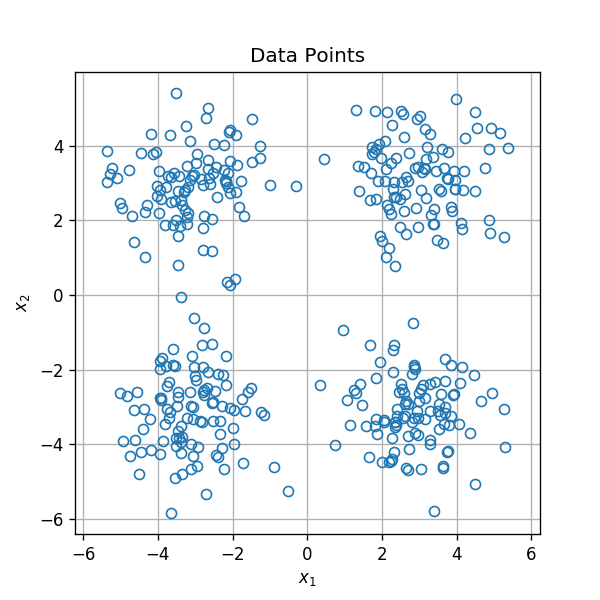{: width="500px" style="vertical-align:middle"}
&#x21E6;
{: width="500px" style="vertical-align:middle"}

</section><section markdown="1">

### דוגמאות

 

1. לבצע הנחות על פרט על סמך פרט אחר באשכול.
     
   לדוגמא: להציע בחנות אינטרנט מוצרים על סמך לקוחות אחרים.
      
2. לתת טיפול שונה לכל אשכול.
     
   לדוגמא: משרד ממשלתי שרוצה להפנות קבוצות שונות באוכלוסיה לערוצי מתן שירות שונים

</section><section markdown="1">

### אלגוריתמי אשכול שונים

ישנם מספר רב של דרכים לבצע אישכול לאוסף של נתונים

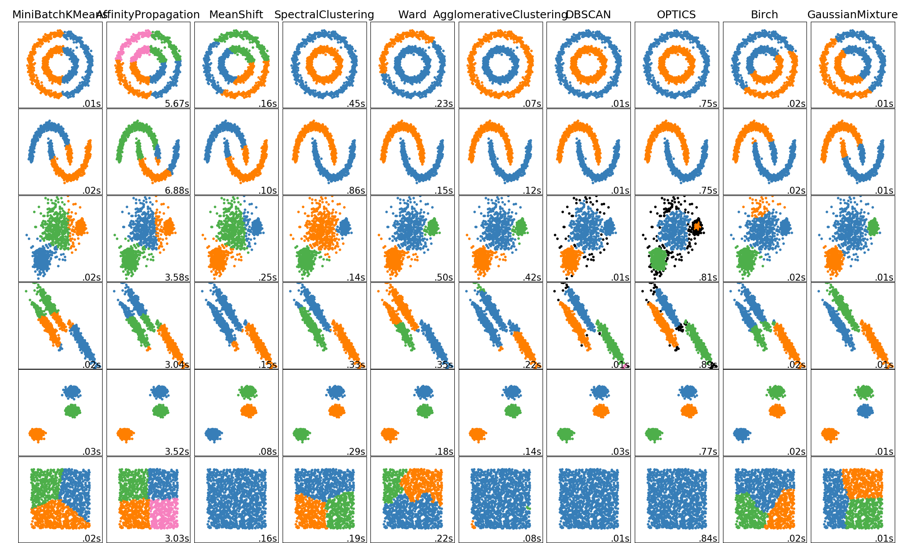{: width="100%"}

**לרוב נעבוד עם נתונים ממימד גבוה, ולא נוכל לצייר את האשכולות.**

</section><section markdown="1">

### האלגוריתם K-means

סימונים:

- $$K$$ - מספר האשכולות (גודל אשר נקבע מראש).
- $$G_i$$ - אוסף האינדקסים של האשכול ה-$$i$$. לדוגמא: $$G_5=\left\lbrace3, 6, 9, 13\right\rbrace$$
- $$\left\lvert G_i\right\rvert$$ - גודל האשכול ה-$$i$$ (מספר הפרטים בקבוצה)
- $$\left\lbrace G_i\right\rbrace$$ - חלוקה מסויימת לאשכולות
- $$\left\lbrace G_i\right\rbrace^*$$ - החלוקה האופטימאלית (תחת קריטריון מסויים)

 

מנסה למזער את המרחק הריבועי הממוצע בין וקטור לבין שאר חברי האשכול שלו:

$$
\underset{\left\{G_i\right\}}{\arg\min}\sum_{i=1}^K\frac{1}{\left\lvert G_i\right\rvert}\sum_{j,k\in S_i}\left\lVert \boldsymbol{x}_j-\boldsymbol{x}_k \right\rVert^2
$$

</section><section markdown="1">

### האלגוריתם K-means

#### הבעיה השקולה

מרכז המסה (center of mass or centroid) או המרכז של אשכול:

$$
\boldsymbol{\mu}_i=\frac{1}{\left\lvert G_i\right\rvert}\sum_{\boldsymbol{x}\in G_i}\boldsymbol{x}
$$

 
 

בעיית האופטימיזציה שקולה לבעיה של מיזעור המרחק הריבועי בין וקטור למרכז המסה של האשכול שלו:

$$
\underset{\left\{G_i\right\}}{\arg\min}\sum_{i=1}^K\sum_{j\in G_i}\left\lVert \boldsymbol{x}_j-\boldsymbol{\mu}_i \right\rVert^2
$$

</section><section markdown="1">

### האלגוריתם K-means

##### שלבי האלגוריתם

- איתחול: $$t=0$$, בחירת $$K$$ מרכזי אשכולות $$\left\lbrace \mu_i^{\left(0\right)} \right\rbrace_{i=1}^K$$
- חזרה עד להתכנסות ($$G_i^{\left(t\right)}=G_i^{\left(t-1\right)}\quad\forall i$$):
  - שיוך כל נקודה לאשכול, על פי המרכז הקרוב עליו ביותר:

    $$
    G_i^{\left(t\right)}=\left\lbrace  j: \left\lVert\boldsymbol{x}_j-\boldsymbol{\mu}_i^{\left(t\right)}\right\rVert^2<\left\lVert\boldsymbol{x}_j-\boldsymbol{\mu}_l^{\left(t\right)}\right\rVert^2 \quad\forall l\neq i\right\rbrace
    $$

    (במקרה של שני מרכזים במרחק זהה נבחר בזה בעל האינדקס הנמוך יותר).

  - עדכון מרכזי האשכולות על פי: $$\boldsymbol{\mu}_i^{\left(t+1\right)}=\frac{1}{\left\lvert G_i^{\left(t\right)}\right\rvert}\sum_{\boldsymbol{x}\in G_i^{\left(t\right)}}\boldsymbol{x}$$
  - קידום: $$t\leftarrow t+1$$

</section><section markdown="1">

#### דוגמא

- איתחול
  
- חזרה עד להתכנסות:
    
  - שיוך כל נקודה לאשכול, על פי המרכז הקרוב
    
  - עדכון מרכזי האשכולות

{: width="700px"}

{: width="700px"}

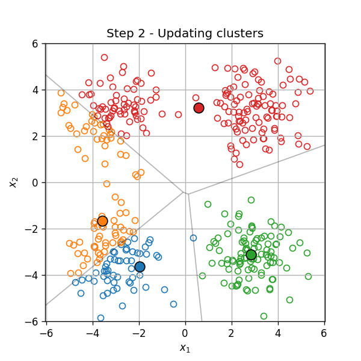{: width="700px"}

{: width="700px"}

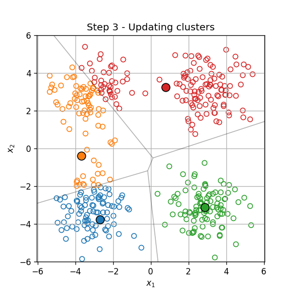{: width="700px"}

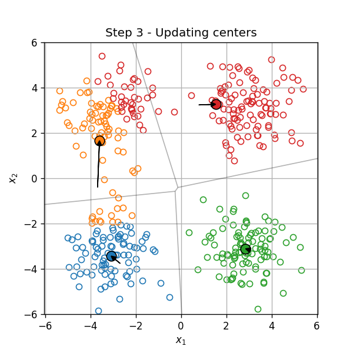{: width="700px"}

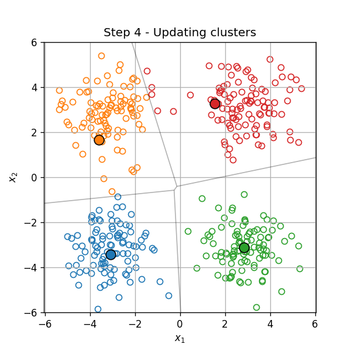{: width="700px"}

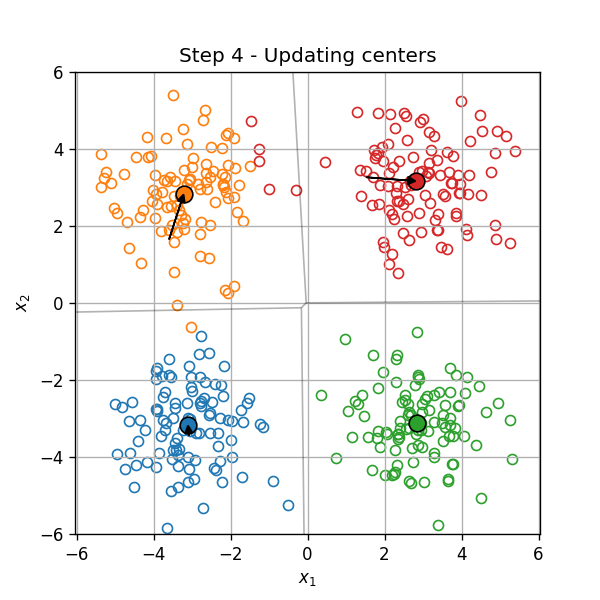{: width="700px"}

{: width="700px"}

{: width="700px"}

{: width="700px"}

{: width="700px"}

{: width="700px"}

{: width="700px"}

{: width="700px"}

{: width="700px"}

</section><section markdown="1">

#### תכונות

 
- מובטח כי פונקציית המטרה תקטן בכל צעד (אלגוריתם חמדן Greedy).
    
- מובטח כי האלגוריתם יתכנס. זאת אומרת שהוא יעצר לאחר מספר סופי של עדכונים.
    
- **לא** מובטח כי האלגוריתם יתכנס לפתרון האופטימאלי.
    
- אתחולים שונים יכולים להוביל לתוצאות שונות.

</section><section markdown="1">

#### בחירת מספר האשכולות K

 

{: width="350px"}
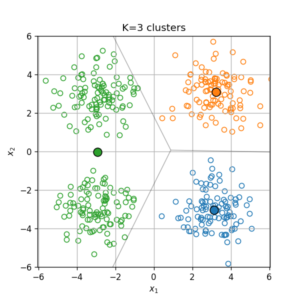{: width="350px"}
{: width="350px"}
{: width="350px"}

 

במקרים מסויימים יהיה עלינו לקבוע את מספר האשכולות כתלות בנתונים.

</section><section markdown="1">

#### בחירת מספר האשכולות K

##### שיטה לקביעת מספר האשכולות: שיפור יחסי קטן

שגיאת האשכול: שורש ממוצע הריבועים (Root Mean Square (RMS)) של המרחקים מהממוצעים:

$$
E\left(K\right)=\sqrt{\frac{1}{N}\sum_{i=1}^K\sum_{j\in G_i}\left\lVert \boldsymbol{x}_j-\boldsymbol{\mu}_i \right\rVert^2}
$$

 

מציאת הנקודה שבה הגדלת מספר האשכולות יתן שיפור היחסי זניח בשגיאת האשכול:

 

$$
\underset{K}{\arg\min}\quad K,\qquad\text{s.t.} \frac{E\left(K\right)-E\left(K+1\right)}{E\left(K\right)}\triangleq\frac{-\Delta E\left(K\right)}{E\left(K\right)}<\epsilon
$$

</section><section markdown="1">

#### בחירת מספר האשכולות K

##### שיטה לקביעת מספר האשכולות: שיפור יחסי קטן - המשך

עבור הדוגמא ממקודם. גרף השגיאה:

{: width="700px"}
{: width="700px"}

</section><section markdown="1">

#### בחירת מספר האשכולות K

##### שיטה לקביעת מספר האשכולות: שיפור יחסי קטן - המשך

גרף השיפור היחסי:

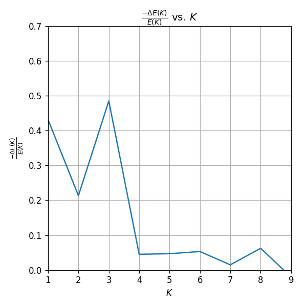{: width="700px"}

בנקודה $$K=4$$ השיפור היחסי צונח משמעותית. לכן הגיוני לבחור 4 אשכולות.

</section><section markdown="1">

## תרגילים

#### ✍️ תרגיל 4.1

 

נתונות $$\left(1+3\alpha\right)n$$ נקודות שונות:

- $$n$$ נקודות בקואורדינאטות $$A=\left(-6,6\right)$$
- $$\alpha n$$ נקודות בכל אחת מהקואורדינאטות $$B=\left(6,6\right),C=\left(8,6\right),D=\left(1,-6\right)$$

 

א) מתאחלים את המרכזים על ידי בחירה אקראית של 3 מתוך ארבעת הנקודות A,B,C,D. לאילו חלוקות יתכנס האלגוריתם בעבור כל אחת מארבעת האתחולים האפשריים.

{: width="600px"}

 

</section><section markdown="1">

##### 💡 תרגיל 4.1א -  פיתרון

א) נחשב את תוצאת האלגוריתם בעבור כל אחת מארבעת האתחולים:

**מרכזים ב A,B ו C**:

 

<ul>
<li>
  שויך התחלתי (0a): נקודות בA,B ו C ישוייכו למרכז אשר הנמצא עליהם, והנקודות בD ישוייכו למרכז שבB.
    
</li>
<li class="fragment">
  עדכון מרכזים (0b): המרכז שב B יזוז לאמצע הדרך שבין הנקודות B ו D.
    
</li>
<li class="fragment">
  עדכון אשכולות (1a): הנקודת שבB ישוייכו כעת למרכז שבC.
    
</li>
<li class="fragment">
  עדכון מרכזים (1b): המרכז שבין B ל D יזוז לD, והמרכז שבC יזוז למחצית הדרך שבין B לC.
</li>
</ul>

{: width="600px"}

{: width="600px"}

{: width="600px"}

{: width="600px"}

</section><section markdown="1">

##### 💡 תרגיל 4.1א -  פיתרון

**מרכזים ב A,B ו D**:

 

<ul>
<li>
  שויך התחלתי (0a): נקודות בA,B ו D ישוייכו למרכז אשר נמצא עליהם, והנקודות בC ישוייכו למרכז שבB.
    
</li>
<li class="fragment">
  עדכון מרכזים (0b): המרכז שב B יזוז לאמצע הדרך שבין הנקודות B ו C.
</li>
</ul>

{: width="600px"}

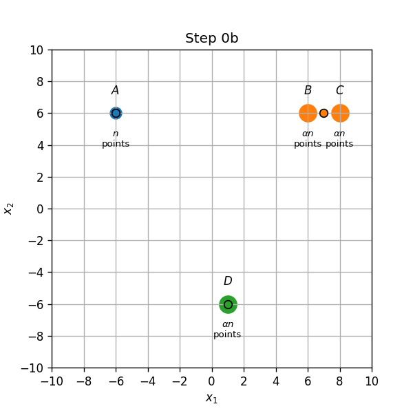{: width="600px"}

</section><section markdown="1">

##### 💡 תרגיל 4.1א -  פיתרון
  
**מרכזים ב A,C ו D**:

<ul>
<li>
  שויך התחלתי (0a): נקודות בA,C ו D ישוייכו למרכז אשר נמצא עליהם, והנקודות בB ישוייכו למרכז שבC.
    
</li>
<li class="fragment">
  עדכון מרכזים (0b): המרכז שב C יזוז לאמצע הדרך שבין הנקודות B ו C.
</li>
</ul>

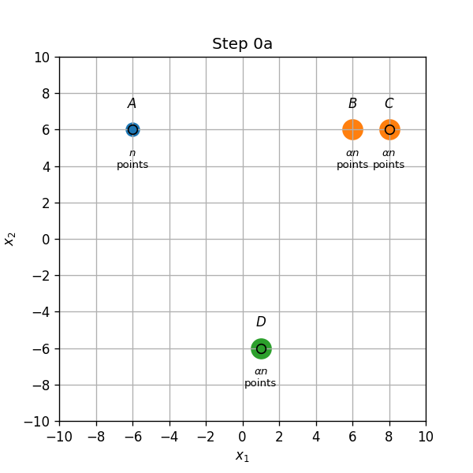{: width="600px"}

{: width="600px"}

</section><section markdown="1">

##### 💡 תרגיל 4.1א -  פיתרון
  
**מרכזים ב B,C ו D**:

<ul>
<li>
  שויך התחלתי (0a): נקודות בB,C ו D ישוייכו למרכז אשר נמצא עליהם, והנקודות בA ישוייכו למרכז שבB.
    
</li>
<li class="fragment">
  עדכון מרכזים (0b): המרכז שב B יזוז לנקודה שהיא המרכז של הנקודות A ו B. (משום שכמות הנקודות בשתי הקבוצות שונה, נקודה זו היא לא אמצע הדרך בניהם).
</li>
</ul>

  
השלב הבא של עידכון האשכולות תלוי במיקום של המרכז החדש.

{: width="600px"}

{: width="400px"}
{: width="400px"}

</section><section markdown="1">

##### 💡 תרגיל 4.1א -  פיתרון
  
**מרכזים ב B,C ו D**:

**מקרה 1**:

המרכז החדש **קרוב** יותר לנקודה B משאר הנקודה C. והאלגוריתם הסתיים:

{: width="600px"}

</section><section markdown="1">

##### 💡 תרגיל 4.1א -  פיתרון
  
**מרכזים ב B,C ו D**:

**מקרה 2**:

המרכז החדש **רחוק** יותר לנקודה B משאר הנקודה C. אזי המשך יהיה:

{: width="600px"}

{: width="600px"}

{: width="600px"}

</section><section markdown="1">

##### 💡 תרגיל 4.1א -  פיתרון
  
**מרכזים ב B,C ו D**:

**מקרה 2**:

נמצא את התנאי על $$\alpha$$ שבעבורו מתרחש מקרה 2.

נסמן ב$$\boldsymbol{\mu}_1$$ את המרכז שבין A לB:

 

$$
\boldsymbol{\mu}_1=\frac{n\vec{A}+\alpha n\vec{B}}{\left(1+\alpha\right)n}=\frac{\left(-6\hat{x}_1 + 6\hat{x}_2\right)+\alpha\left(6\hat{x}_1 + 6\hat{x}_2\right)}{1+\alpha}=\frac{\alpha-1}{\alpha+1}6\hat{x}_1 + 6\hat{x}_2
$$

 

על מנת שיתרחש עידכון על המרחק בין המרכז החדש נקודה B גדול מ2:

$$
\left\lVert\left(6\hat{x}_1 + 6\hat{x}_2\right)-\left(\frac{\alpha-1}{\alpha+1}6\hat{x}_1 + 6\hat{x}_2\right)\right\rVert>2 \\
\Leftrightarrow\alpha<5
$$

</section><section markdown="1">

#### ✍️ תרגיל 4.1

 

ב) מהו האשכול האופטימאלי (הממזער של פונקציית המטרה)? רשמו את הפתרון כתלות בפרמטר $$\alpha$$. (ניתן להניח כי בפתרון האופטימאלי כל הנקודות שנמצאות באותו המקום משוייכות לאותו האשכול)

{: width="600px"}

 

</section><section markdown="1">

##### 💡 תרגיל 4.1ב -  פיתרון
  
 

נרצה למזער את:

$$
\sum_{i=1}^K\frac{1}{2\left\lvert G_i\right\rvert}\sum_{j,k\in S_i}\left\lVert \boldsymbol{x}_j-\boldsymbol{x}_k \right\rVert^2
$$

 

נפסול פתרונות עם אשכול ריק. לכן הפתרון יהיה אחד מ:

- (A,B), (C), (D)
- (A,C), (B), (D)
- (A,D), (B), (C)
- (B,C), (A), (D)
- (B,D), (A), (C)
- (C,D), (A), (B)

</section><section markdown="1">

##### 💡 תרגיל 4.1ב -  פיתרון - המשך

התרומה של האכולות עם נקודה בודדת הינה 0, ולכן יש לחשב רק את התרומה של האשכול שמכיל זוג נקודות. למשל בעבור (A,B), (C), (D):

$$
\sum_{i=1}^K\frac{1}{2\left\lvert G_i\right\rvert}\sum_{j,k\in S_i}\left\lVert \boldsymbol{x}_j-\boldsymbol{x}_k \right\rVert^2
=\frac{1}{N_A+N_B}\left(N_A N_B\left\lVert\vec{B}-\vec{A}\right\rVert^2\right)
$$

בעבור כל שאר האשכולות:

| Clusters | Objective |
| -------- | --------- |
| (A,B), (C), (D) | $$\frac{\alpha n^2}{\left(\alpha+1\right)n}12^2=144\frac{\alpha n}{\alpha+1}$$ |
| (A,C), (B), (D) | $$\frac{\alpha n^2}{\left(\alpha+1\right)n}\left(7^2+12^2\right)=193\frac{\alpha n}{\alpha+1}$$ |
| (A,D), (B), (C) | $$\frac{\alpha n^2}{\left(\alpha+1\right)n}14^2=196\frac{\alpha n}{\alpha+1}$$ |
| (B,C), (A), (D) | $$\frac{\alpha^2 n^2}{2\alpha n}2^2=2\alpha n$$ |
| (B,D), (A), (C) | $$\frac{\alpha^2 n^2}{2\alpha n}\left(5^2+6^2\right)=30.5\alpha n$$ |
| (C,D), (A), (B) | $$\frac{\alpha^2 n^2}{2\alpha n}\left(7^2+6^2\right)=42.5\alpha n$$ |

 

לכן הפתרון יהיה (A,B),(C),(D) או (B,C),(A),(D)

</section><section markdown="1">

##### 💡 תרגיל 4.1ב -  פיתרון - המשך

נבדוק בעבור אלו ערכים של $$\alpha$$ האשכול הראשון הינו האופטימאלי (ולהפיך):

$$
144\frac{\alpha n}{\alpha+1}<2\alpha n \\
\Leftrightarrow \alpha>71
$$

 

- בעבור $$\alpha>71$$ הפתרון האופטימאלי הינו (A,B),(C),(D).
- בעבור $$\alpha<71$$ הפתרון האופטימאלי הינו  (B,C),(A),(D).

עבור התוצאות מהסעיף הקודם:

 

- בעבור $$\alpha>71$$ הפתרון האופטימאלי הינו (A,B),(C),(D), אך עבור 3 מתוך 4 האיחולים שבדקנו האלגוריתם התכנס לפתרון של  (B,C),(A),(D).
    
- בעבור $$\alpha<71$$ הפתרון האופטימאלי הינו  (B,C),(A),(D), אך במקרה של $$\alpha>5$$ ואתחול של מרכזים ב B,C ו D מתקבל הפתרון של (A,B),(C),(D).

</section><section markdown="1">

#### ✍️ תרגיל 4.1

 

ג) האם קיים אתחול אשר בעבורו האלגוריתם לא יתכנס לפתרון בעל הערך המינימאלי שמצאתם בסעיף הקודם? הדגימו.

{: width="600px"}

 

##### פיתרון

כל מקרים שצויינו בסעיף הקודם. בנוסף,ניתן לדוגמא לאתחל שניים מתוך שלושת המרכזים בנקודות מאד רחוקות, ואז כל הנקודות ישוייכו למרכז השלישי.

</section><section markdown="1">

## בעיה מעשית

### 🚖 תזכורת: מדגם נסיעות המונית בNew York

עשרת הדגמים הראשונים במדגם הנסיעות בעיר New York

<table border="1" style="text-align:center;">
  <thead>
    <tr>
      <th></th>
      <th>passenger_count</th>
      <th>trip_distance</th>
      <th>payment_type</th>
      <th>fare_amount</th>
      <th>tip_amount</th>
      <th>pickup_easting</th>
      <th>pickup_northing</th>
      <th>dropoff_easting</th>
      <th>dropoff_northing</th>
      <th>duration</th>
      <th>day_of_week</th>
      <th>day_of_month</th>
      <th>time_of_day</th>
    </tr>
  </thead>
  <tbody>
    <tr>
      <th>0</th>
      <td>2</td>
      <td>2.768065</td>
      <td>2</td>
      <td>9.5</td>
      <td>0.00</td>
      <td>586.996941</td>
      <td>4512.979705</td>
      <td>588.155118</td>
      <td>4515.180889</td>
      <td>11.516667</td>
      <td>3</td>
      <td>13</td>
      <td>12.801944</td>
    </tr>
    <tr>
      <th>1</th>
      <td>1</td>
      <td>3.218680</td>
      <td>2</td>
      <td>10.0</td>
      <td>0.00</td>
      <td>587.151523</td>
      <td>4512.923924</td>
      <td>584.850489</td>
      <td>4512.632082</td>
      <td>12.666667</td>
      <td>6</td>
      <td>16</td>
      <td>20.961389</td>
    </tr>
    <tr>
      <th>2</th>
      <td>1</td>
      <td>2.574944</td>
      <td>1</td>
      <td>7.0</td>
      <td>2.49</td>
      <td>587.005357</td>
      <td>4513.359700</td>
      <td>585.434188</td>
      <td>4513.174964</td>
      <td>5.516667</td>
      <td>0</td>
      <td>31</td>
      <td>20.412778</td>
    </tr>
    <tr>
      <th>3</th>
      <td>1</td>
      <td>0.965604</td>
      <td>1</td>
      <td>7.5</td>
      <td>1.65</td>
      <td>586.648975</td>
      <td>4511.729212</td>
      <td>586.671530</td>
      <td>4512.554065</td>
      <td>9.883333</td>
      <td>1</td>
      <td>25</td>
      <td>13.031389</td>
    </tr>
    <tr>
      <th>4</th>
      <td>1</td>
      <td>2.462290</td>
      <td>1</td>
      <td>7.5</td>
      <td>1.66</td>
      <td>586.967178</td>
      <td>4511.894301</td>
      <td>585.262474</td>
      <td>4511.755477</td>
      <td>8.683333</td>
      <td>2</td>
      <td>5</td>
      <td>7.703333</td>
    </tr>
    <tr>
      <th>5</th>
      <td>5</td>
      <td>1.561060</td>
      <td>1</td>
      <td>7.5</td>
      <td>2.20</td>
      <td>585.926415</td>
      <td>4512.880385</td>
      <td>585.168973</td>
      <td>4511.540103</td>
      <td>9.433333</td>
      <td>3</td>
      <td>20</td>
      <td>20.667222</td>
    </tr>
    <tr>
      <th>6</th>
      <td>1</td>
      <td>2.574944</td>
      <td>1</td>
      <td>8.0</td>
      <td>1.00</td>
      <td>586.731409</td>
      <td>4515.084445</td>
      <td>588.710175</td>
      <td>4514.209184</td>
      <td>7.950000</td>
      <td>5</td>
      <td>8</td>
      <td>23.841944</td>
    </tr>
    <tr>
      <th>7</th>
      <td>1</td>
      <td>0.804670</td>
      <td>2</td>
      <td>5.0</td>
      <td>0.00</td>
      <td>585.344614</td>
      <td>4509.712541</td>
      <td>585.843967</td>
      <td>4509.545089</td>
      <td>4.950000</td>
      <td>5</td>
      <td>29</td>
      <td>15.831389</td>
    </tr>
    <tr>
      <th>8</th>
      <td>1</td>
      <td>3.653202</td>
      <td>1</td>
      <td>10.0</td>
      <td>1.10</td>
      <td>585.422062</td>
      <td>4509.477536</td>
      <td>583.671081</td>
      <td>4507.735573</td>
      <td>11.066667</td>
      <td>5</td>
      <td>8</td>
      <td>2.098333</td>
    </tr>
    <tr>
      <th>9</th>
      <td>6</td>
      <td>1.625433</td>
      <td>1</td>
      <td>5.5</td>
      <td>1.36</td>
      <td>587.875433</td>
      <td>4514.931073</td>
      <td>587.701248</td>
      <td>4513.709691</td>
      <td>4.216667</td>
      <td>3</td>
      <td>13</td>
      <td>21.783056</td>
    </tr>
  </tbody>
</table>

</section><section markdown="1">

### ❓️ הבעיה: מציאת חניונים

 

חברת מוניות רוצה לשכור $$K$$ מגרשי חניה ברחבי העיר NYC בהם יוכלו לחכות המוניות שלה בין הנסיעות.

לשם כך היא מעוניינת לבחור באופן אופטימאלי את המיקומים של מגרשי החניות האלו כך שהמרחק הממוצע מנקודת הורדת הנוסע למרגש החניה הקרוב יהיה מינימאלי.

 

#### שדות רלוונטיים

הפעם נתמקד בשתי השדות:

- **dropoff_easting** - הקואורדינאטה האורכית (מזרח-מערב) של סיום הנסיעה
- **dropoff_northing** - הקואורדינאטה הרוחבית (צפון-דרום) של סיום הנסיעה

(למתעניינים: הקואורדינאטות נתונות בUTM-WGS84, היחידות הן בקירוב קילומטר).

</section><section markdown="1">

### ❓️ הבעיה: מציאת חניונים - משך

#### ויזואליזציה של נקודות ההורדה

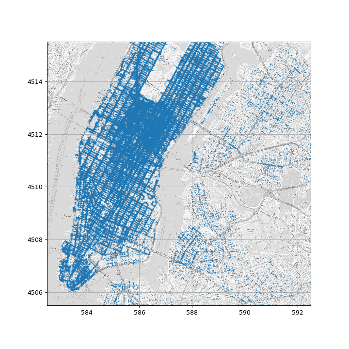

</section><section markdown="1">

### הגדרה פורמאלית של הבעיה

נשתמש בסימונים הבאים:

- $$X$$ הוקטור האקראי של מיקום סיום הנסיעה
- $$\boldsymbol{c}_i$$: המיקום של החניות ה-$$i$$.
- $$N$$: מספר הנסיעות במדגם.

 

המטרה: למצוא את מיקומי החניונים האופטימאליים אשר ממזערים את:

$$
R\left(\left\lbrace\boldsymbol{c}_i\right\rbrace\right)=\mathbb{E}\left[\min_{i}\left\lVert\boldsymbol{x}-\boldsymbol{c}_i\right\rVert\right]
$$

 

מכיוון שאנו לא יודעים משהו הפילוג של $$X$$ נחליף את התחולת על $$X$$ בתוחלת האימפירית

$$
\hat{R}\left(\left\lbrace\boldsymbol{c}_i\right\rbrace\right)=\frac{1}{N}\sum_{j}\min_{i}\left\lVert\boldsymbol{x}_j-\boldsymbol{c}_i\right\rVert
$$

</section><section markdown="1">

### הגדרה פורמאלית של הבעיה - המשך

$$
\hat{R}\left(\left\lbrace\boldsymbol{c}_i\right\rbrace\right)=\frac{1}{N}\sum_{j}\min_{i}\left\lVert\boldsymbol{x}_j-\boldsymbol{c}_i\right\rVert
$$

 

את הבעיה שקיבלנו ניתן לרשום כבעיית אשכול.
נגדיר את האשכול $$G_i$$, כאוסף כל הנסיעות שהחניון ה$$i$$ הוא הקרוב ביותר.

 

$$
\hat{R}\left(\left\lbrace\boldsymbol{c}_i\right\rbrace\right)=\frac{1}{N}\sum_{i=1}^K\sum_{j\in G_i}\left\lVert\boldsymbol{x}_j-\boldsymbol{c}_i\right\rVert
$$

</section><section markdown="1">

### פתרון באמצעות K-Means

$$
\hat{R}\left(\left\lbrace\boldsymbol{c}_i\right\rbrace\right)=\frac{1}{N}\sum_{i=1}^K\sum_{j\in G_i}\left\lVert\boldsymbol{x}_j-\boldsymbol{c}_i\right\rVert
$$

 

- הבעיה שקיבלנו דומה מאד לK-Means, אם הבדל משמעותי אחד.
- K-Means ממזער את המרחק ה**ריבועי** הממוצע בעוד שאנו מחפשים למזער את המרחק האוקלידי.

 

*זהו מצב נפוץ שבו איננו מסוגלים לפתור בעיה מסויימת באופן ישיר אז אנו פותרים בעיה דומה לה, בתקווה לקבל תוצאות מספקות.*

</section><section markdown="1">

#### הרצה

{: width="850px"}

המרחק נסיעה הממוצע המתקבל הינו 700 מ'.

</section><section markdown="1">

### ✍️ תרגיל 4.2

 

1) ציינו שתי סיבות מדוע המיקומים שקיבלנו הם לא בהכרח אופטימאליים

 

2) הציעו דרכים לשפר את התוצאות על סמך הסיבות מסעיף הקודם.

#### פתרון

1) K-Mean לא מבטיח התכנסות למינימום הגולבאלי. ניתן להריץ את האלגוריתם מספר פעמים עם איתחולים שונים.

 

2) K-Mean ממזערת את השגיאה הריבועית הממוצעת. ניתן לשפר על ידי תיקון המרכז לנקודה אשר ממזערת את המרחק עצמו.

**הערה:** ראו חציון הגיאומטרי *The Geometric Median* ([wiki](https://en.wikipedia.org/wiki/Geometric_median)) ו *Weiszfeld's algorithm*.

</section><section markdown="1">

## ❓️ בעיה 2: מציאת מספר החניונים האופטימאלי

- עד כה השתמשנו ב10 חניונים.
- נרצה כעת לבחור גם מספר זה בצורה מיטבית

נניח כי:

1. עלות האחזקה של חניון הינה 10k$ לחודש.
2. בכל חודש יהיו בדיוק 100k נסיעות.
3. עלות הנסיעה של מונית בדרך לחניון הינה 3$ לקילומטר.

נרשום תחת הנחות אלו את העלות החודשית של אחזקת החניונים והנסיעה אליהם:

$$
R\left(\left\lbrace\boldsymbol{c}_i\right\rbrace, K\right)= 10\cdot K+100\cdot3\cdot\mathbb{E}\left[\min_{j}\left\lVert\boldsymbol{x}-\boldsymbol{c}_j\right\rVert\right]
$$

והמקבילה האמפירית:

$$
\hat{R}\left(\left\lbrace\boldsymbol{c}_i\right\rbrace, K\right)= 10\cdot K+300\cdot\frac{1}{N}\sum_{i=1}^K\sum_{\boldsymbol{x}_j\in G_i}\left\lVert\boldsymbol{x}_j-\boldsymbol{c}_i\right\rVert
$$

</section><section markdown="1">

### מספר החניונים כHyper parameter

- כעת עלינו לבצע אופטימיזציה גם על מספר החניונים וגם המיקום שלהם.
- ראינו כיצד ניתן למצוא פתרון בעבור $$K$$ נתון.
- חל נעבור על כל ערכי $$K$$ הרלוונטים, וניקח הפתרון הטוב ביותר.

 

- פרמטרים שאין לנו שיטה יעילה לבחור אותם אנו מכנים לרוב ה**Hyper-parameters** של המודל.
- שני hyper-parameters בהם כבר נתקלנו בקורס הינם:
  - מספר ורוחב התאים של היסטוגרמה
  - רוחב וסוג הגרעין בKDE

 

לרוב נאלץ לבחור את ערכם של הhyper-parameters על ידי:

1. חיפוש על גריד (grid search) או מעבר על כל האפשרויות (brute force).
2. ניסוי וטעיה. כאשר לרוב נתחיל מאיזשהו ניחוש מושכל.

</section><section markdown="1">

### פתרון באמצעות K-Means וסריקת על K.

נריץ את אלגוריתם הK-Means בעבור כל ערך של $$K$$ בתחום $$1\leq K \leq 25$$:

{: width="600px"}

נקבל כי:

- מספר החניונים האופטימאלי הינו: 12.
- מרחק הנסיעה הממוצע יהיה 630 מ'.
- העלות הכוללת תהיה 308.12k$ לחודש.

</section><section markdown="1">

## תרגילים נוספים

#### ✍️ תרגיל 4.3

נתבונן בבעיית "האשכול" החד-מימדית הבאה:
{: width="600px"}

כאשר הנקודות $$\left\lbrace x_i\right\rbrace_{i=0}^N$$ ממוקמות באופן אחיד באינטרוול $$\left[0,d\right]$$ ומספרן $$N\rightarrow\infty$$. (וכמובן $$\Delta\rightarrow 0$$).

 

הראו כי האלגוריתם K-Means עם $$K=2$$ מתכנס למינימום הגלובלי של השגיאה הריבועית **מכל תנאי התחלה סביר** (כלומר, המרכזים ההתחלתיים ממוקמים באינטרוול $$\left[0,d\right]$$).

</section><section markdown="1">

##### 💡 פיתרון

- $$x^{\left(n\right)}$$ את נקודת ההחלטה באיטרציה $$n$$
- $$\mu_2^{\left(n\right)},\mu_1^{\left(n\right)}$$ את המרכזים באיטרציה $$n$$. 

 

אזי:

$$
x^{\left(0\right)}=\frac{\mu_1^{\left(0\right)}+\mu_2^{\left(0\right)}}{\alpha d}
$$
  
עם $$0\geq\alpha\geq1$$ כלשהו.

באיטרציה הראשונה, נקבל

$$
\begin{cases}
\mu_1^{\left(1\right)}=\frac{1}{2}\alpha d \\
\mu_2^{\left(1\right)}=\alpha d+\frac{d-\alpha d}{2}=\frac{1+\alpha}{2}d
\end{cases}\\
\Rightarrow x^{\left(1\right)}=\frac{\mu_1^{\left(1\right)}+\mu_2^{\left(1\right)}}{\alpha d}=\frac{1}{2}\alpha d+\frac{1}{4}d
$$

</section><section markdown="1">

##### 💡 פיתרון - המשך

ובאופן כללי,

$$
\begin{cases}
\mu_1^{\left(n\right)}=\frac{1}{2} x^{\left(n-1\right)}\\
\mu_2^{\left(n\right)}=\frac{x^{\left(n-1\right)}+d}{2}\\
\end{cases}\\
\Rightarrow x^{\left(n\right)}=\frac{1}{2}x^{\left(n-1\right)}+\frac{1}{4}d
$$

נפתור את הרקורסיה:

$$
x^{\left(n\right)}=\frac{1}{2}x^{\left(n-1\right)}+\frac{1}{4}d=d\left(\frac{1}{4}+\frac{1}{8}\right)+\frac{1}{2^2}x^{\left(n-2\right)}=\frac{d}{4}\sum_{i=0}^{n-1}\frac{1}{2^i}+\frac{1}{2^n}x^{\left(0\right)}
$$

מכאן שבגבול $$n\rightarrow\infty$$ מתקיים כי $$x^{\left(n\right)}\rightarrow\frac{d}{2}$$, שזהו כמובן הפתרון האופטימאלי (חלוקה של הקטע לשני חלקים שווים).

</section>
