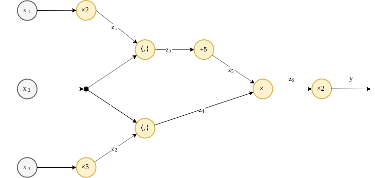
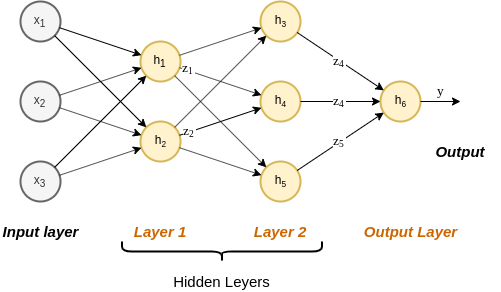
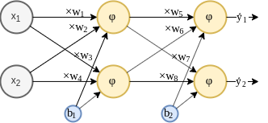
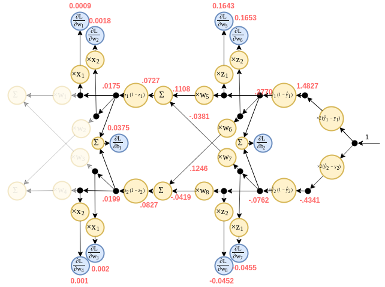
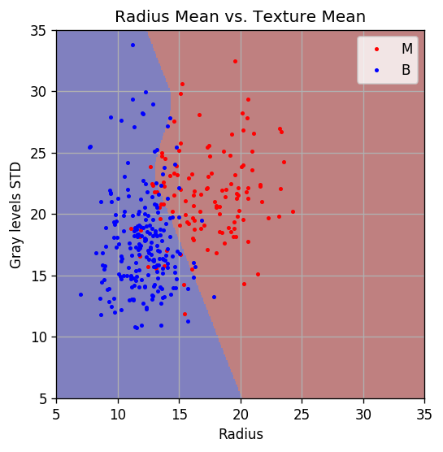

## תיאוריה

### Artificial Neural Networks (ANN)

רשתות ניורונים מלאכותיות (Artificial Neural Networks (ANN)) הינם מודלים מתמטיים אשר בנויים בהשראת רשתות נוירונים ביולוגיותץ בדומה לרשות הביולוגיות, הם בנויות כאוסף של יחידות המכונות לרוב נוירונים מלאכותיים, אשר מבצעות כל אחת פעולה מתימטית פשוטה. כאשר משלבים הרבה נויורונים כאלה יחד (מיפוי המוצאים של נויורונים מסויימות לכניסות של נוירונים איחרים) ניתן למדל פונקציות מורכבות.


בחירה נפוצה לפעולה המתימטית אותה מבצעים הנוירונים הינה של פונקציה לא נינארית סקלרית הפועלת על קומבינציה לינארית בתוספת קבוע (bias) של הכניסות שלה:

$$
h\left(\boldsymbol{x}\ ;\boldsymbol{\theta},b\right)=\varphi\left(\boldsymbol{\theta}^T\boldsymbol{x}+b\right)
$$

הפונקציה הלא לינארית $$\varphi$$ מוכנה לרוב פונקציית הפעלה. בחירות נפוצות של הפונקציית ההפעלה הינן:

- הפונקציה הלוגיסטית, המכונה לרוב גם סיגמואיד (sigmoid): $$\varphi\left(x\right)=\frac{1}{1+e^{-x}}$$
- טנגנס היפרבולי: $$\varphi\left(x\right)=\tanh\left(x/2\right)$$
- פונקציה "מיישרת", המכונה ReLU (Rectified Linear Unit): $$\varphi\left(x\right)=\max\left(x,0\right)$$

הנוירונים אשר אינם מחוברים למוצא הרשת (אינם נמצאים בסוף הרשת) מוכנים **יחידות נסתרות** (**hidden units**). רשתות אשר מכילות מסלולים מהכניסה למוצא אשר עוברים דרך יותר מיחידה נסתרת אחת מכונות **רשתות עמוקות** (**Deep Neural Networks (DNN)**)

הצורה שבה הנוירונים מחוברים בתור הרשת נקראת הארכיטקטורה של הרשת. אנו מבדילים בין שני סוגי ארכיטקטורות:

- **רשת הזנה קדמית** (**Feed-forward networks**): אריטקטורות אשר אינם מכילות מסלולים מעגליים (המידע זורם בכיוון אחד מהכניסה למוצא).
- **רשתות נשנות** (**recurrent networks**): ארכיטקטורות אשר מכילות מסלולים מעגליים. בקורס זה לא נעסוק ברשתות מסוג זה.

השימוש ברשתות אלו הינו כמודל לייצוג הפונקציה שאותה אנו מנסים ללמוד (פונקציית החיזוי או הפילוג). בדומה למודלים שאשר איתם עבדנו עד כה אנו ננסה ללמוד את הפרמטרים של הרשת על סמך המדגם שבידינו, כאשר הלימוד של הפרמטרים נעשה לרוב על ידי שימוש באלגוריתם הגרדיאנט. את הגרדיאנט מחשבים בעזרת שיטה המוכנה **back propagation**, עליו נדבר בהרחבה בתרגול זה.

#### ייצוג פונקציה כרשת - דוגמא

נסתכל על הפונקציה הבאה:

$$
y=2\left(\left(2\boldsymbol{x}_1\right)^T\boldsymbol{x}_2+5\right)\cdot\left(\left(3\boldsymbol{x}_3\right)^T\boldsymbol{x}_2\right)
$$

ניתן לייצג פונקציה זו כגרף באופן הבא:



כאשר:

$$
\boldsymbol{z}_1=2\boldsymbol{x}_1 \\
\boldsymbol{z}_2=3\boldsymbol{x}_3 \\
z_3=\boldsymbol{z}_1^T\boldsymbol{x}_2 \\
z_4=\boldsymbol{z}_2^T\boldsymbol{x}_2 \\
z_5=z_3+5 \\
z_6=z_4\cdot z_5 \\
y=2z_6
$$

נחשב לדוגמא את מוצא הרשת בעבור הכניסות הבאות:

$$
x_1 = \left(1,2\right)^T
x_2 = \left(3,4\right)^T
x_3 = \left(5,6\right)^T
$$

תהליך זה מוכנה הforwad pass:


$$
\boldsymbol{z}_1=2\left(1,2\right)^T=\left(2,4\right)^T \\
\boldsymbol{z}_2=3\left(5,6\right)^T=\left(15,18\right)^T \\
z_3=\left(2,4\right)\left(3,4\right)^T=22 \\
z_4=\left(15,18\right)\left(3,4\right)^T=117 \\
z_5=22+5=27 \\
z_6=27\cdot 117=3159 \\
y=2\cdot 3159=6318
$$

### Back-Propogation

שיטת הBack propogation הינה שיטה לחישוב הנגזרת של פונקציה המיוצגת כגרף על ידי שימוש בכלל השרשרת של נגזרות. נסתכל על הדוגמא ממקודם, בעזרת כלל השרשרת נוכל לרשום את הנגזרת $$\frac{dy}{d\boldsymbol{x}_1}$$ באופן הבא:

$$
\frac{dy}{d\boldsymbol{x}_1}=\frac{\partial y}{\partial z_6}\frac{\partial z6}{\partial z_5}\frac{\partial z5}{\partial z_3}\frac{\partial z_3}{\partial \boldsymbol{z}_1}\frac{\partial \boldsymbol{z}_1}{\partial \boldsymbol{x}_1}
$$

ובאופן דומה:

$$
\frac{dy}{d\boldsymbol{x}_2}=\frac{\partial y}{\partial z_6}\frac{\partial z6}{\partial z_5}\frac{\partial z5}{\partial z_3}\frac{\partial z_3}{\partial \boldsymbol{x}_2}+\frac{\partial y}{\partial z_6}\frac{\partial z6}{\partial z_4}\frac{\partial z_4}{\partial \boldsymbol{x}_2} \\
\frac{dy}{d\boldsymbol{x}_3}=\frac{\partial y}{\partial z_6}\frac{\partial z6}{\partial z_4}\frac{\partial z_4}{\partial \boldsymbol{z}_2}\frac{\partial \boldsymbol{z}_2}{\partial \boldsymbol{x}_3}
$$

או באופן גרפי:


נוכל כמובן לרשום זאת גם כגרף אחד כאשר אנו מאחדים את כל החישובים הזהים ובכך מייעלים את החישוב:


נשים לב כי למעשה לגרף זה צורה דומה לגרף של הפונקצייה המקורית, אם כי בכיוון הפוך. באופן כללי ניתן להראות כי ניתן להפוך כל גרף של פונקציה על מנת לקבל את הגרף של הנגזרת שלה באופן הבא:

1. הופכים את כיוון הזרימה בגרף. זאת אומרת שכל המוצאים של יחידת חישוב הופכים לכניסות ולהיפך.
2. מכפילים כל מוצא מיחידה בנגזרת של המשתנה בכניסה ליחידה על פי המשתנה באותו מוצא.
3. מחליפים את כל יחידות החישוב המקוריות בסכימות הכניסות אליהן (אם ישנה רק כניסה אחת אז אותה כניסה פשוט מוברת לכל המוצאים).

בעבור הדומא שלנו נקבל:


נשיב לב בי בגרף המתקבל מופיעים הערכים של המשנים $$z_i$$ ולכן על מנת לחשב את הנגזרות יהיה עלינו תמיד תחילה לחשב את הערכים המקבלים בגרף הפונקציה המקורית. החישוב של הפונקציה המקורית נקרא הforward pass וחישוב של הנגזרות מתוך הגרך ההפוץ נקרא הbackward pass.

### Multilayer Perceptron (MLP)

אחת הארכיטקטורות הפשוטות ביותר הנמצאות בשימוש הינה ארכיטקטורת ה**Multilayer Perceptron (MLP)**. במודל זה הנוירונים מסודרים בשתייים או יותר שכבות (layers) כאשר כל נוירון מוזן מ**כל** הנוריונים שבשכבה שלפניו. רשת בעלת תכונה זו מכונה רשת בעלת **fully connected leyers**. הנוירונים בMLP הינם פונקציית אקטיבציה הפועלת על קומבינציה לינארית (פלוס קבוע, bias) של הכניסות.



הHyperparameters של MLP הינם:

- מספר השכבות
- מספר הנוירונים בכל שכבה
- פונקציית האקטיבציה

והפרמטרים הנלמדים הינם המשקולות והקבוע בקומבינציה לניארית.

### הערה חשובה!!!!

בבואנו להשתמש בארגוריתם הגרדיאנט לשם לימוד הפרמטרים שך הרשת אנו נהיה מעוניינים בחישוב הנגזרת של פונקציית ההפסד/סיכון על פי הפרמטרים של הרשת ולא על פי התצפיות $$x$$. זאת אומרת שאנו נהיה מעוניינים לבנות את גרף הנגזרות מהמוצא לכל אחד מהפרמטרים של המודל.

### הערה נוספת לגבי שמות

1. במתמטיקה השם **loss function** (פונקציית ההספד) נמצא בשימוש נרחב לתאר פונקציה כלשהיא שאותה אנו רוצים למזער. בקורס זה השתמשנו במושג זה ספציפית על מנצ לתאר את ה"קנס" אותו אנו משלמים על חיזוי יחיד $$l\left(\hat{y},y\right)$$. כמו כן השתמשנו במושג **risk** (סיכון) לתאור התוחלת (או התוחלת האמפירית) של ההפסד. בהקשר של deep learning המושג loss נמצא לרוב בשימוש בגרסא הרחבה שלו לתיאור פונקציה כל שהיא, מתייחס לרוב לסיכון עצמו לגודל אחר אותו אנו נרצה למזער.
2. בתמטיקה השם **sigmoid** מתייחס לאוסף רחב של פונקצייות בעלות צורת S. בהקשר של deep learning, שם זה מתייחס לרוב לפונקציה הלוגיסטית. ההגדרה מוויקיפדיה: "A sigmoid function is a bounded, differentiable, real function that is defined for all real input values and has a non-negative derivative at each point"

## תרגילים

#### תרגיל 9.1 - Back propogation

בעובר הפונקציה הבאה:

$$
y=\left(\boldsymbol{x}_1+2\boldsymbol{x}_2\right)^T\boldsymbol{x}_3/5
$$

וערכי הכניסה הבאים:

$$
\boldsymbol{x}_1=\left(1,2\right)^T\\
\boldsymbol{x}_2=\left(3,4\right)^T\\
\boldsymbol{x}_3=\left(5,6\right)^T\\
$$

שרטטו את הפונקציה כגרף המורכב מיחידות המבצעות פעולות פשוטות (חיבור וקטורים, מכפלה וקטורית וכפל בסקלר). שרטטו את הגרף של חישוב הנגזרת בעבור כניסות כלשהם וחשבו את הforward והbackward pass.

##### פתרון

גרף הפונקציה:


גרף הנגזרת:


Forward pass:


Backward pass:


#### תרגיל 9.2 - Back propogation in MLP

נתונה רשת מטיפוס MLP בעלת שתי כניסות, $$x_1,x_2$$, שכבה נסתרת אחת המכילה 2 נוירונים ושתי יציאות $$\hat{y}_1,\hat{y}_2$$. פונקציית האקטיבציה ברשת זו הינה הפונקציה הלוגיסטית ($$\varphi\left(x\right)=\frac{1}{1+e^{-x}}$$). בנוסף נתון כי כל נוירונים בכל שכבה חולקים את אותו רכיב bias.



נרצה ללמד רשת זו על מנת להקטין פונקציית הפסד מסוג $$l_2$$: $$l\left(\hat{\boldsymbol{y}},\boldsymbol{y}\right)=\left\lVert\boldsymbol{y}-\hat{\boldsymbol{y}}\right\rVert_2^2$$, כאשר $$\boldsymbol{\hat{y}}=\left(\hat{y}_1,\hat{y}_2\right)^T$$.

בעבור ערך התצפית $$\boldsymbol{x}=\left(0.05,0.1\right)^T$$ והתוויות $$\boldsymbol{y}=\left(0.01, 0.99\right)$$, השתמש בשיטת הback propogation על מנת לחשב את הגרטיאנט המקבל בעבור פרמטרי הרשת הבאים:

$$
w_1=0.15 \\
w_2=0.2 \\
w_3=0.25 \\
w_4=0.30 \\
b_1=0.35 \\
w_5=0.4 \\
w_6=0.45 \\
w_7=0.5 \\
w_8=0.55 \\
b_2=0.6
$$

##### פתרון

גרף הפונקציה המלא, הכולל גם את פונקציית ההפסד נראה כך:


נזכיר כי אנו מעוניינים לחשב את הגרדיאנט בין המוצא, המסומן כ$$L$$ לכל אחת מעשרת פרמטרי הרשת.

נבנה את הגרף לחישוב הנגזרת על פי העקרונות ממקודם. נשתמש בעובדה כי ניתן לבטא את הנגזרת של הפונקציה הלוגיסטית ניתנת לביטוי על ידי מוצא הפונקציה: $$\varphi'\left(x\right)=\varphi\left(x\right)\left(1-\varphi\left(x\right)\right)$$. אחרי מעט עבודה נקבל את הגרף הבא:


נחשב ראשית את הforward pass:


וכעת את הbackward pass:



#### תרגיל 9.3 - משפט הקירוב האוניברסלי

א) הראו כיצד ניתן לייצג את הפונקציה הבאה בעזרת רשת feedforward המכילה מנוירונים בעלי פונקציית הפעלה מסוג ReLU, $$\varphi\left(x\right)=\max\left(x,0\right)$$, (הפועל על קומבינציה לינארית של הכניסות). שרטטו את הרשת ורשמו את הערכים של פרמטרי הרשת.
ב) האם ניתן לייצג **במדוייק** את הפונקציה $$f\left(x\right)=x^2+\left\lvertx\right\rvert$$ בעזרת רשת feedforward המכילה מנוירונים בעלי פונקציית הפעלה מסוג ReLU (הפועל על קומבינציה לינארית של הכניסות) בלבד? הסבירו ו/או הדגימו.

##### פתרון

א)

בעזרת נויירונים אם פונקציית אקטיבציה מסוג ReLU הפועלים על קומבינציה לינארית של הכניסות נוכל לבנות פונקציות רציפות ולינאריות למקוטעין, בעלות מספר סופי של קטעים, כמו זו בשבשאלה זו.

נבנה פונקציה זו בעזרת MLP בעל שיכבה נסתרת אחת אשר דואגת לייצג את המקטעים השונים ושיכבת מוצא אשר דואגת לשיפוע בכל מקטע. נבנה את השכבה הנסתרת בעזרת מספר נירונים כמספר נקודות המעבר בין מקעים ונתאים את נקודת השינוי בנגזרת של הReLU של כל אחד מהנוירונים לנקודת שינוי בנגזרת של פונקציית המטרה:


$$
h_1\left(x\right)=\max(x+1,0) \\
h_2\left(x\right)=\max(x,0) \\
h_3\left(x\right)=\max(x-1,0) \\
$$

כעת נדאג לשיפועים. נסתכל על מקטעים משמאל לימין.

- המקטע הימני ביותר הינו בעל שיפוע 0 ולכן הוא כבר מסודר שכן כל הפונקציות אקטיבציה מתאפסות באיזור זה.
- המקטע $$\left[-1,0\right]$$ מושפע רק מן הנוירון הראשון. השיפוע במקטע זה הינו 1 ולכן ניתן משקל של 1 לנירון זה.
- המקטע $$\left[0,1\right]$$ מושפע משני הנוירונים הראשונים. הנוירון הראשון כבר תורם שיפוע של 1 במקטע זה ולכן עלינו להוסיף לו עוד שיפוע של $$-2$$ על מנת לקבל את השיפוע של $$-1$$ הנדרש. ולכן ניתן משקל של $$-2$$ לנירון השני.
- באופן דומה ניתן לנוןירון השלישי משקל של $$2$$.

סה"כ קיבלנו כי $$h_4\left(z_1,z_2,z_3\right)=z_1-2z_2*2z_3

ב)

כפי שציינו, בעזרת ReLU נוכל לבנות רק פונקציות רציפות ולינאריות למקוטעין. מכיוון ש$$x^2$$ אינה לינארית אנו נוכל רק לקרב אותה אך לא לייצג אותה במדוייק.

הסיבה לכך שאנו יכולים לייצג רק פונקציות רציפות ולינאריות למקוטעין הינה משום שReLU הינה פונקציה רציפה ולינארית למקוטעין וכל הרכבה או סכימה של פונקציות מסוג זה יצרו תמיד פונקציה חדשה שגם היא רציפה ולינארית למקוטעין.

## בעיה מעשית

### סביבות פיתוח - Deep Learning Frameworks

עם הצמיחה בפופולריות של התחום של deep learning הופיעו מספר רב של סביבות פיתוח (frameworks). סביבות אלו מגיעות לרוב כספיריה (או toolbox) בעבור שפת תכנות קיימת. ספריות אלו מפשטות מאד את תהליך הפילוח של מערכות המבוססות על רשתות נוירונים. הם לרוב מציעות יכולות כגון:

- מימוש של מגוון פונקציות נפוצות כגון פונקציות אקטיבציה וכלים לבניית רשתות.
- ביצוע back propogation באופן אוטומטי.
- הרצת אלגומיתמי גרדינאט מתוחכמים.
- הרצת הרשתות והאופטימיזציה על GPU לשם האצה.

מצורפת רשימה חלקית של סביבות שכאלה:

- **[TensorFlow](https://www.tensorflow.org/)**: סיפריית Python אשר פותחה ומתוחזקת על ידי Google. כיום סביבת הפילוח הפופולרית ביותר.

- **[PyTorch](https://pytorch.org/)**: ספרית Python נוספת אשר מבוססת על ספריה ישנה יותר הנקראת [Torch](http://torch.ch/) אשר נכתבה לשפה בשם [LUA](https://en.wikipedia.org/wiki/Lua_(programming_language)). הספריה מפותחת ומתוחזקת על ידי Facebook. ספריה זו מעט יותר צעירה וצוברת פופולריות בקצב מהיר. כיום פופולרית כמעט כמו TensorFlow.

- **[Caffe](https://caffe.berkeleyvision.org/) & [Caffe2](https://caffe2.ai/)**: ספריה מעט ישנה יותר בעל תמיכה ל C, C++, Pyhton ו Matlab. הספריה פותחה במקור בBerkley וכיום מתוחזקת על ידי פייסבוק. הפופולריות של ספריה זו הולך ופוחת בשנים האחרונות.

- **[Keras](https://keras.io/)**: ספרית Python אשר נבנתה על גבי ספריות אחרות כגון TensorFlow ומציע ממשק יותר "ידידותי". ספריה זו יותר אבסטרקציה גבוהה יותר של תהליך התכנון והאימון של הרשת אך גם עקב כך גם מאשפרת פחות שליטה עך תהליך זה.

- **[fast.ai](https://www.fast.ai/)**: סביבת פיתוח חדשה יחסית אשר עוטפת את PyTorch ומציעה יכולות נוספות והגדרות ברירת מחדל טובות יותר על מנת לייעל את תהליך התכנון והאימון של הרשתות. סביבה זו קיבלה תגובות חיוביות רבות בקהילת הdeep learning ומתחילה לאט לאט לצבור פופולריות.

- **[Matlab](https://www.mathworks.com/help/deeplearning/getting-started-with-deep-learning-toolbox.html)**: לאחרונה, פרסמה MathWorks (החברה שכותבת את Matlab) Toolbox לעבודה עם רשתות ניורונים.

בתרגול הבית הרטוב בקורס זה תתנסו בבניה ואימון של רשת בעזרת PyTorch. הבחירה לעבוד עם PyTorch הינה בעיקר בגלל הדמיון שלו לNum-Py אשר מאפשר התחלת עבודה מהירה ואינטואיטיבית.

### PyTorch

בתרגול זה נחזור לבעיית הסיווג של תאים סרטניים. אנו נשתמש בPyTorch על מנת לשחזר את הפתרון מהתרגול הקודם של מציאת מודל אופטימאלי של linear logistic regression, ונרחיב מודל זה למודל של MLP.

הדרך הנכונה לבניה והרצה של רשתות בPyTorch היא על ידי הגדרת class יעודי לרשת שאיתה נרצה לעבוד. הדבר נעשה באופן הבא:

```python
## Defining the network
class Net(torch.nn.Module):
    def __init__(self):
        ## The following line should appear in the begining of the __init__ function.
        ## It is realted to inheretance issues and we will not elaborate on this here.
        super(Net, self).__init__()

        ## Defining some objects which will be used in the forward function.
        self.linear = torch.nn.Linear(2, 1)  ## A linear model with input of 2 and output of 1.
        self.sigmoid = torch.nn.Sigmoid()  ## A sigmoid function

    def forward(self, x):
        ## The function which defines the forward pass.
        x = self.linear(x)
        x = self.sigmoid(x)

        return x
```

הרשת הנל מתארת מודל של linear logistic regresion, המוצא הינו קומבינציה לינארית של 2 משתני כניסה שאליה מופעל sigmoid כפונקציית אקטיבציה.כאן נעשה פה שימוש ב:

- **[torch.nn.Model]**: אובייקט שממנו יש לרשת כאשר יוצרים רשת חדש בPyTorch. בקורס זה לא נרחיב על הנושא ונתייחס לצורה זו כאל תבנית שבה יש להשתמש.
- **[torch.nn.Linear](https://pytorch.org/docs/stable/nn.html#linear)**: אובייקט אשר מבעת טרנספורמציה לינארית (לייתר דיוק אפינית) על וקטור כניסה מסיים.
- **[torch.nn.Sigmoid](https://pytorch.org/docs/stable/nn.html#sigmoid)** אובייקט הממש את פונקציית sigmoid.

הקוד לאימון של רשת זו הינו כלהן:

```python
def basic_gradient_decent(net, alpha, tol, max_iter, x_train, y_train):
    ## Set the loss function
    loss_func = torch.nn.BCELoss()

    ## Initizalie the optimizer
    opt = torch.optim.SGD(net.parameters(), lr=alpha)

    while True:
        opt.zero_grad()
        prob = net(x_train)
        objective = loss_func(prob, y_train.float())  ## Forward pass
        objective.backward()  ## Backward pass
        opt.step()  ## Perform the update step

        ## Check the stop criteria
        if (torch.abs(objective - last_objective) < tol) or (i_iter == max_iter):
            break

## Optimization parameters
## =======================
tol = 1e-7
max_iter = 100000
alpha = 1e-2

net = Net().cuda()
basic_gradient_decent(net, alpha, tol, max_iter, x_train, y_train)
```

- האובייקט של **[torch.nn.BCELoss](https://pytorch.org/docs/stable/nn.html#bceloss)** BCELoss מגדיר loss באופן הבא:

  $$
  l\left(\left\lbrace y_i, p_i\right\rbrace\right)=-\frac{1}{N}\sum_i\log\left(p_i\right)y_i + \log\left(1-p_i\right)\left(1-y_i\right)
  $$

  וניתן להראות כי הגדרה זו שקולה לפתרות MLE.
- האובייקט של **[torch.optim.SGD](https://pytorch.org/docs/stable/optim.html?highlight=sgd#torch.optim.SGD)** מגדיר את אלגוריתם האופטמיזציה ומקבל באיתחול את רשימת הפרמטרים שעליהם מבוצעת האופטימיזציה.

#### תוצאה

הסיכון המשוערך על סט הבחן הינו: 0.096. הגרף של פונקציית המטרה של האופטימיציזה כפונקציה של מספר האיטרציה הינו:


### MLP

ניתן כעת בקלות להרחיב מודל זה לMLP פשוט על ידי הוספה של שכבות נוספות. נוסיף שכבה נוספת של 2 נוירונים ונרה כיצד הדבר משפיע על התוצאות.

```python
class NetMLP(nn.Module):
    def __init__(self):
        ## The following line should appear in the begining of the __init__ function.
        ## It is realted to inheretance issues and we will not elaborate on this here.
        super(NetMLP, self).__init__()

        self.linear1 = nn.Linear(2, 2)  ## input: 2 feature, output: 2 features
        self.linear2 = nn.Linear(2, 1)  ## input: n_units_in_hidden, output: 1
        self.sigmoid = nn.Sigmoid()  ## A sigmoid function

        torch.random.manual_seed(0)
        torch.nn.init.normal_(self.linear1.weight)
        torch.nn.init.normal_(self.linear2.weight)

    def forward(self, x):
        x = self.linear1(x)
        x = self.sigmoid(x)
        x = self.linear2(x)
        x = self.sigmoid(x)

        return x
```

#### תוצאה

הסיכון המשוערך על סט הבחן הינו: 0.07. הגרף של פונקציית המטרה של האופטימיציזה כפונקציה של מספר האיטרציה הינו:


כלל החלטה נראה כך:

The test risk is: $$0.07$$


