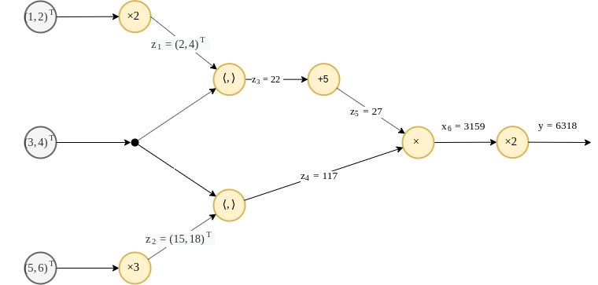
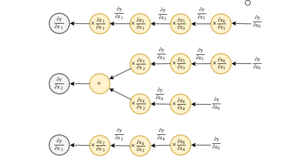
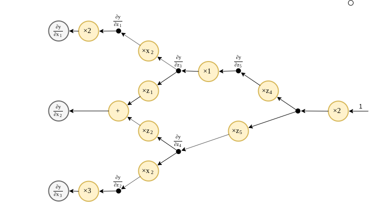
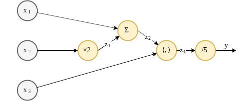
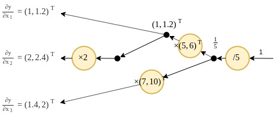
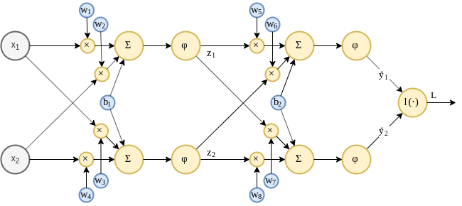
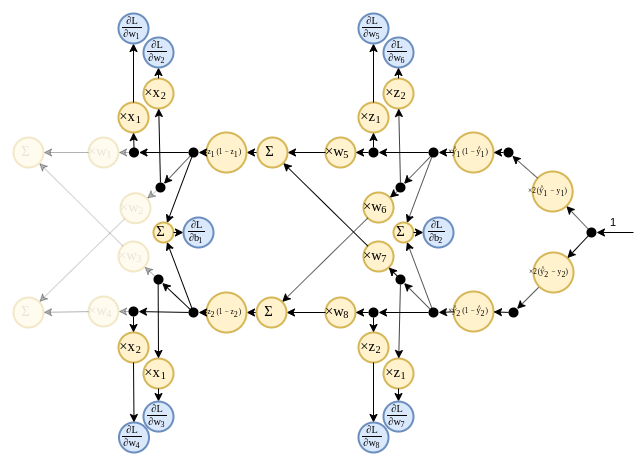
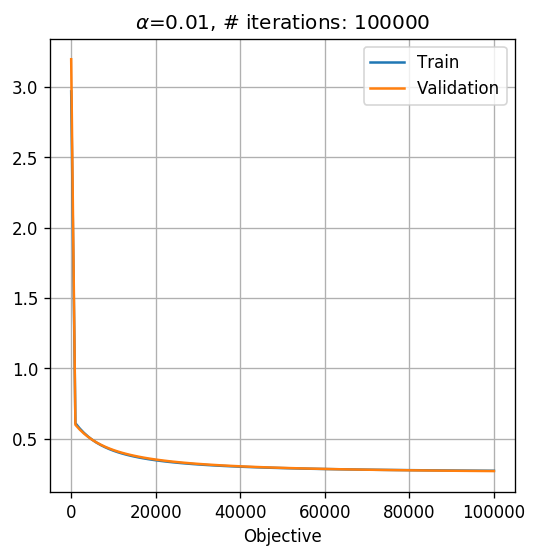

<section markdown="1">

## תיאוריה

### Artificial Neural Networks (ANN)

{: width="1000px"}

- בנויות בהשראת רשתות נוירונים ביולוגיות.<br><br>
- בנויות כאוסף של יחידות אשר מבצעות כל אחת פעולה מתימטית פשוטה.<br><br>
- יחידות אלו מכונות לרוב נוירונים מלאכותיים.<br><br>

</section><section markdown="1">

### Artificial Neural Networks (ANN) - המשך

לרוב, נוירונים יבצעו את הפועלה של:

1. קומבינציה לינארית של הכניסות לנוירון והוספת קבוע (bias).
2. הפעלה של פונקציה סקלארית לא לינארית. (פונקציית הפעלה)

<br>

$$
h\left(\boldsymbol{x}\ ;\boldsymbol{\theta},b\right)=\varphi\left(\boldsymbol{\theta}^T\boldsymbol{x}+b\right)
$$

<br><br>

פונקציית ההפעלה נפוצות:

- הפונקציה הלוגיסטית (sigmoid): $$\varphi\left(x\right)=\frac{1}{1+e^{-x}}$$<br><br>
- טנגנס היפרבולי: $$\varphi\left(x\right)=\tanh\left(x/2\right)$$<br><br>
- ReLU (Rectified Linear Unit): $$\varphi\left(x\right)=\max\left(x,0\right)$$<br><br>

אלא אם צויין אחרת, אנו נניח כי הנויירונים ברשת בנויים בצורה זו.

</section><section markdown="1">

### Artificial Neural Networks (ANN) - המשך 2

{: width="700px"}

מושגים:

- **יחידות נסתרות** (**hidden units**): הנוירונים אשר אינם מחוברים למוצא הרשת.<br><br>
- **רשת עמוקה** (**deep network**): רשת בעלת מסלולים עם יותר מיחידה נסתרת אחת.<br><br>
- **ארכיטקטורה**: הצורה שבה הנוירונים מחוברים בתוך הרשת.<br><br>

</section><section markdown="1">

### Artificial Neural Networks (ANN) - המשך 3

{: width="700px"}

סוגי ארכיטקטורות:

- **רשת הזנה קדמית** (**Feed-forward networks**): רשת אשר אינה מכילה מסלולים מעגליים (המידע זורם מהכניסה למוצא).<br><br>
- **רשתות נשנות** (**recurrent networks**): ארכיטקטורות אשר מכילות מסלולים מעגליים. בקורס זה לא נעסוק ברשתות מסוג זה.<br><br>

אנו נשתמש ברשתות אלו כמודל, ונאמן אותן בעזרת אלגוריתם הגרדיאנט ושיטה המכונה **back-propagation**.

</section><section markdown="1">

### Multilayer Perceptron (MLP)

{: width="800px"}

<br>

- אחת הארכיטקטורות הפשוטות ביותר הנמצאות בשימוש.<br><br>
- הנוירונים מסודרים בשתייים או יותר שכבות (layers) (שכבת הכניסה לא נספרת).<br><br>
- כל נוירון מוזן מ**כל** הנוריונים שבשכבה שלפניו. (**fully connected leyers**)<br><br>

</section><section markdown="1">

### Multilayer Perceptron (MLP) - המשך

{: width="800px"}

<div style="display:grid;grid-template-columns:50% 50%"><div style="grid-column:1/2" markdown="1">
Hyperparameters:

- מספר השכבות<br><br>
- מספר הנוירונים בכל שכבה<br><br>
- פונקציית האקטיבציה<br><br>

</div><div style="grid-column:2/2;" markdown="1">
פרמטרים:

- המשקולות ואברי הbias בקומבינציה הלניארית.

</div></div>

</section><section markdown="1">

### הערה חשובה!!!!

<br><br>

בבואנו להשתמש בארגוריתם הגרדיאנט אנו נהיה מעוניינים בחישוב הנגזרת של פונקציית ההפסד/סיכון על פי ה**פרמטרים** של הרשת (ולא על פי התצפיות $$x$$).

</section><section markdown="1">

### הערה נוספת לגבי שמות

<br>

1. במתמטיקה ובdeep learning השם **loss function** מתאר פונקציה כל שהיא שאותה אנו רוצים למזער (ולא בהכרח ה"כנס" על שגיאת החיזוי)<br><br><br><br><br>
2. במתמטיקה **sigmoid** מתייחס לאוסף רחב של פונקצייות בעלות צורת S, בהקשר של deep learning, שם זה מתייחס לרוב לפונקציה הלוגיסטית.

</section><section markdown="1">

### Back-Propagation

#### ייצוג פונקציה גרף - דוגמא

לשם המחשה, נסתכל על הפונקציה הבאה:

$$
y=2\left(\left(2\boldsymbol{x}_1\right)^T\boldsymbol{x}_2+5\right)\cdot\left(\left(3\boldsymbol{x}_3\right)^T\boldsymbol{x}_2\right)
$$

ניתן לייצג פונקציה זו כגרף באופן הבא:

<div style="display:grid;grid-template-columns:20% 80%"><div style="grid-column:1/2" markdown="1">
$$
\boldsymbol{z}_1=2\boldsymbol{x}_1 \\
\boldsymbol{z}_2=3\boldsymbol{x}_3 \\
z_3=\boldsymbol{z}_1^T\boldsymbol{x}_2 \\
z_4=\boldsymbol{z}_2^T\boldsymbol{x}_2 \\
z_5=z_3+5 \\
z_6=z_4\cdot z_5 \\
y=2z_6
$$
</div><div style="grid-column:2/2;" markdown="1">
{: width="1000px"}
</div></div>

</section><section markdown="1">

#### ייצוג פונקציה גרף - דוגמא - המשך

נחשב את מוצא הרשת בעבור הכניסות הבאות:

$$
x_1 = \left(1,2\right)^T
x_2 = \left(3,4\right)^T
x_3 = \left(5,6\right)^T
$$

<br><br>

<div style="display:grid;grid-template-columns:40% 60%"><div style="grid-column:1/2" markdown="1">
$$
\boldsymbol{z}_1=2\left(1,2\right)^T=\left(2,4\right)^T \\
\boldsymbol{z}_2=3\left(5,6\right)^T=\left(15,18\right)^T \\
z_3=\left(2,4\right)\left(3,4\right)^T=22 \\
z_4=\left(15,18\right)\left(3,4\right)^T=117 \\
z_5=22+5=27 \\
z_6=27\cdot 117=3159 \\
y=2\cdot 3159=6318
$$
</div><div style="grid-column:2/2;" markdown="1">
{: width="1000px"}
</div></div>

תהליך זה מוכנה הforwad pass

</section><section markdown="1">

#### חישוב הנגזרות בעזרת הגרף

{: width="700px"}

נשתמש בכלל השרשרת על מנת לרשום את הנגזרת של המוצא על פי הכניסות:

$$
\frac{dy}{d\boldsymbol{x}_1}=\frac{\partial y}{\partial z_6}\frac{\partial z6}{\partial z_5}\frac{\partial z5}{\partial z_3}\frac{\partial z_3}{\partial \boldsymbol{z}_1}\frac{\partial \boldsymbol{z}_1}{\partial \boldsymbol{x}_1}
$$

<br>

$$
\frac{dy}{d\boldsymbol{x}_2}=\frac{\partial y}{\partial z_6}\frac{\partial z6}{\partial z_5}\frac{\partial z5}{\partial z_3}\frac{\partial z_3}{\partial \boldsymbol{x}_2}+\frac{\partial y}{\partial z_6}\frac{\partial z6}{\partial z_4}\frac{\partial z_4}{\partial \boldsymbol{x}_2}
$$

<br>

$$
\frac{dy}{d\boldsymbol{x}_3}=\frac{\partial y}{\partial z_6}\frac{\partial z6}{\partial z_4}\frac{\partial z_4}{\partial \boldsymbol{z}_2}\frac{\partial \boldsymbol{z}_2}{\partial \boldsymbol{x}_3}
$$

</section><section markdown="1">

#### חישוב הנגזרות בעזרת הגרף - המשך

{: width="700px"}

או באופן גרפי:

{: width="1000px"}

</section><section markdown="1">

#### חישוב הנגזרות בעזרת הגרף - המשך 2

{: width="700px"}

נאחד את כל החישובים הזהים:

{: width="1000px"}

</section><section markdown="1">

#### חישוב הנגזרות בעזרת הגרף - המשך 3

{: width="800px"}

{: width="800px"}

לשני הגרפים צורה זהה אך כיוון החישוב בהם הינו הפוך.

</section><section markdown="1">

#### חישוב הנגזרות בעזרת הגרף - המשך 3

ניתן להפוך כל גרף של פונקציה להגרף של הנגזרת שלו באופן הבא:

1. הופכים את כיוון הזרימה בגרף<br><br>
2. מוסיפים כפל בנגזרת לכל יציאה מייחידת חישוב.<br><br>
3. את יחידות החישוב המקוריות מחליפים בפעולת סכימה על הכניסות.

{: width="1000px"}

</section><section markdown="1">

#### חישוב הנגזרות בעזרת הגרף - המשך 4

נחשב כעת את הנגזרות ונציב אותם לגרף:

{: width="900px"}

- בגרף המתקבל מופיעים הערכים של המשתנים $$z_i$$.<br><br>
- על מנת לחשב את הנגזרות עלינו לחשב את הערכים המקבלים בגרף המקורי.<br><br>
- החישוב של הפונקציה המקורית נקרא הforward pass.<br><br>
- החישוב של הנגזרות מתוך הגרך ההפוך נקרא הbackward pass.<br><br>

</section><section markdown="1">

## תרגילים

#### תרגיל 9.1 - Back propagation

נתונה הפונקציה הבאה:

$$
y=\left(\boldsymbol{x}_1+2\boldsymbol{x}_2\right)^T\boldsymbol{x}_3/5
$$

<br>

שרטטו את הפונקציה כגרף המורכב מיחידות המבצעות פעולות פשוטות (חיבור וקטורים, מכפלה וקטורית וכפל בסקלר). שרטטו את הגרף של הפונקציה עצמה ואת הגרף של הנגזרת . חשבו את הforward והbackward pass בעבור ערכי הכניסה הבאים:

$$
\boldsymbol{x}_1=\left(1,2\right)^T\\
\boldsymbol{x}_2=\left(3,4\right)^T\\
\boldsymbol{x}_3=\left(5,6\right)^T\\
$$

</section><section markdown="1">

##### פתרון

גרף הפונקציה:

{: width="1000px"}

</section><section markdown="1">

##### פתרון - המשך

גרף הנגזרת:

{: width="1000px"}

</section><section markdown="1">

##### פתרון - המשך 2

Forward pass:

{: width="1000px"}

</section><section markdown="1">

##### פתרון - המשך 3

Backward pass:

{: width="1000px"}

</section><section markdown="1">

#### תרגיל 9.2 - Back propagation in MLP

נתונה רשת מסוג MLP בעלת שתי כניסות, $$x_1,x_2$$, שכבה נסתרת אחת המכילה 2 נוירונים ושתי יציאות $$\hat{y}_1,\hat{y}_2$$. פונקציית האקטיבציה ברשת זו הינה הפונקציה הלוגיסטית ($$\varphi\left(x\right)=\frac{1}{1+e^{-x}}$$). בנוסף נתון כי כל נוירונים בכל שכבה חולקים את אותו רכיב bias.

<br>

{: width="1000px"}

<br>

נרצה ללמד רשת זו בעזרת אלגוריתם הגרדיאנט ופונקציית הפסד מסוג $$l_2$$: $$l\left(\hat{\boldsymbol{y}},\boldsymbol{y}\right)=\left\lVert\boldsymbol{y}-\hat{\boldsymbol{y}}\right\rVert_2^2$$, כאשר $$\boldsymbol{\hat{y}}=\left(\hat{y}_1,\hat{y}_2\right)^T$$.

</section><section markdown="1">

#### תרגיל 9.2 - Back propagation in MLP

{: width="800px"}

בעבור ערך התצפית $$\boldsymbol{x}=\left(0.05,0.1\right)^T$$ והתוויות $$\boldsymbol{y}=\left(0.01, 0.99\right)$$, השתמש בשיטת הback propagation על מנת לחשב את הגרדיאנט המקבל בעבור פרמטרי הרשת הבאים:

<div style="display:grid;grid-template-columns:50% 50%"><div style="grid-column:1/2" markdown="1">
$$
w_5=0.4 \\
w_6=0.45 \\
w_7=0.5 \\
w_8=0.55 \\
b_2=0.6
$$
</div><div style="grid-column:2/2;" markdown="1">
$$
w_1=0.15 \\
w_2=0.2 \\
w_3=0.25 \\
w_4=0.30 \\
b_1=0.35 \\
$$
</div></div>

</section><section markdown="1">

##### פתרון

גרף הפונקציה המלא, הכולל גם את פונקציית ההפסד נראה כך:

{: width="1300px"}

נזכיר כי אנו מעוניינים לחשב את הגרדיאנט בין המוצא, המסומן כ$$L$$ לכל אחת מעשרת פרמטרי הרשת.

</section><section markdown="1">

##### פתרון - המשך

- נבנה את הגרף לחישוב הנגזרת על פי העקרונות ממקודם.
- בעבור הפונקציה הלוגיסטית מתקיים: $$\varphi'\left(x\right)=\varphi\left(x\right)\left(1-\varphi\left(x\right)\right)$$

{: width="1100px"}

</section><section markdown="1">

##### פתרון - המשך 2

נחשב ראשית את הforward pass:

{: width="1500px"}

</section><section markdown="1">

##### פתרון - המשך 3

וכעת את הbackward pass:

{: width="1100px"}

</section><section markdown="1">

#### תרגיל 9.3 - משפט הקירוב האוניברסלי

א) הראו כיצד ניתן לייצג את הפונקציה הבאה בעזרת רשת feedforward המכילה מנוירונים בעלי פונקציית הפעלה מסוג ReLU, $$\varphi\left(x\right)=\max\left(x,0\right)$$. שרטטו את הרשת ורשמו את הערכים של פרמטרי הרשת.


ב) האם ניתן לייצג **במדוייק** את הפונקציה $$f\left(x\right)=x^2+\left\lvert x\right\rvert$$ בעזרת רשת feedforward המכילה מנוירונים בעלי פונקציית הפעלה מסוג ReLU בלבד? הסבירו ו/או הדגימו.

</section><section markdown="1">

##### פתרון - א


בעזרת נויירונים בעלי פונקציית אקטיבציה מסוג ReLU נוכל לבנות פונקציות רציפות ולינאריות למקוטעין, בעלות מספר סופי של קטעים, כמו זו בשבשאלה זו.

<br>

- נשתמש בMLP בעל שיכבה נסתרת אחת<br><br>
- השכבה הנסתרת תדאג לחלוקה למקטעים.<br><br>
- שכבת המוצא תדאג לשיפועים.

</section><section markdown="1">

##### פתרון - א - המשך

<div style="display:grid;grid-template-columns:40% 60%"><div style="grid-column:1/2" markdown="1">


{: width="400px"}
</div><div style="grid-column:2/2;" markdown="1">
נשתמש במספר נויירונים כמספר המקומות בהם הפונקציה משנה את השיפוע שלה, ונתאים את השבירה של הReLU לנקודות אלו בעזרת רכיב הbias:

$$
h_1\left(x\right)=\max(x+1,0) \\
h_2\left(x\right)=\max(x,0) \\
h_3\left(x\right)=\max(x-1,0) \\
$$
</div></div>

</section><section markdown="1">

##### פתרון - א - המשך 2

<div style="display:grid;grid-template-columns:40% 60%"><div style="grid-column:1/2" markdown="1">


{: width="400px"}

$$
h_1\left(x\right)=\max(x+1,0) \\
h_2\left(x\right)=\max(x,0) \\
h_3\left(x\right)=\max(x-1,0) \\
$$
</div><div style="grid-column:2/2;" markdown="1">

נדאג לשיפועים משמאל לימין:

- המקטע השמאלי ביותר הינו בעל שיפוע 0 ולכן הוא כבר מסודר.<br><br>
- המקטע $$\left[-1,0\right]$$ מושפע רק מן הנוירון הראשון. השיפוע במקטע זה הינו 1 ולכן ניתן משקל של 1 לנירון זה.<br><br>
- המקטע $$\left[0,1\right]$$ מושפע משני הנוירונים הראשונים. הנוירון הראשון כבר תורם שיפוע של 1 במקטע זה ולכן עלינו להוסיף לו עוד שיפוע של $$-2$$ על מנת לקבל את השיפוע של $$-1$$ הנדרש. ולכן ניתן משקל של $$-2$$ לנירון השני.<br><br>
- באופן דומה ניתן לנוירון השלישי משקל של $$2$$.<br><br>


</div></div>

</section><section markdown="1">

##### פתרון - א - המשך 2

סה"כ קיבלנו:

<div style="display:grid;grid-template-columns:50% 50%"><div style="grid-column:1/2" markdown="1">


{: width="400px"}
</div><div style="grid-column:2/2;" markdown="1">
$$
h_1\left(x\right)=\max(x+1,0) \\
h_2\left(x\right)=\max(x,0) \\
h_3\left(x\right)=\max(x-1,0) \\
h_4\left(z_1,z_2,z_3\right)=z_1-2z_2*2z_3
$$
</div></div>

</section><section markdown="1">

##### פתרון - ב

מכיוון ש:

1. נוירון בעל פונקציית הפעלה מסוג ReLU מייצג פונקציה רציפה ולינארית למקוטעין. <br><br>
2. כל הרכבה או סכימה של פונקציות רציפות ולינאריות למקוטעין יצרו תמיד פונקציה חדשה שגם היא רציפה ולינארית למקוטעין. <br><br>

בעזרת נוירונים מסוג ReLU נוכל רק לייצג פונקציות רציפות ולנאריות למקוטעין.

<br><br>

מכיוון ש$$x^2$$ אינה לינארית אנו נוכל רק לקרב אותה אך לא לייצג אותה במדוייק.

</section><section markdown="1">

## בעיה מעשית

### סביבות פיתוח - Deep Learning Frameworks

ספיריות (או toolboxs) בעבור שפות תכנות קיימת אשר מפשטות מאד את תהליך הפיתוח של מערכות המבוססות על רשתות נוירונים. הן לרוב מציעות יכולות כגון:

- מימוש של מגוון פונקציות נפוצות כגון פונקציות אקטיבציה וכלים לבניית רשתות.<br><br>
- ביצוע back propagation באופן אוטומטי.<br><br>
- הרצת אלגומיתמי גרדינאט מתוחכמים.<br><br>
- הרצת הרשתות והאופטימיזציה על GPU לשם האצה.<br><br>

</section><section markdown="1">

### סביבות פיתוח - Deep Learning Frameworks - המשך

רשימה חלקית של סביבות שכאלה:

- **[TensorFlow](https://www.tensorflow.org/)**: סיפריית Python. פותחה ומתוחזקת על ידי Google. כיום סביבת הפיתוח הפופולרית ביותר.

- **[PyTorch](https://pytorch.org/)**: ספריית Python. מבוססת על ספריה הנקראת [Torch](http://torch.ch/) אשר נכתבה ל[LUA](https://en.wikipedia.org/wiki/Lua_(programחming_language)). מפותחת ומתוחזקת על ידי Facebook. יותר צעירה וצוברת פופולריות. כיום פופולרית כמעט כמו TensorFlow.

- **[Caffe](https://caffe.berkeleyvision.org/) & [Caffe2](https://caffe2.ai/)**: ספריה ישנה יותר. בעלת תמיכה ב C, C++, Pyhton ו Matlab. פותחה במקור בBerkley וכיום מתוחזקת על ידי פייסבוק. הפופולריות של ספריה זו הולך ופוחת בשנים האחרונות.

- **[Keras](https://keras.io/)**: ספריית Python אשר נבנתה על גבי ספריות אחרות כגון TensorFlow ומציעה ממשק יותר "ידידותי", אך מאפשרת פחות שליטה.

- **[fast.ai](https://www.fast.ai/)**: חדשה יחסית. עוטפת את PyTorch ומציעה יכולות נוספות והגדרות ברירת מחדל טובות יותר. קיבלה תגובות חיוביות רבות ומתחילה לצבור פופולריות.

- **[Matlab](https://www.mathworks.com/help/deeplearning/getting-started-with-deep-learning-toolbox.html)**: לאחרונה, פרסמה MathWorks (החברה שכותבת את Matlab) Toolbox לעבודה עם רשתות ניורונים.

</section><section markdown="1">

### PyTorch - Logistic Regression

<br><br>

בתרגול הקודם פתרנו את בעיית סיווג התאים הסרטניים בעזרת מודל של linear logistic regression.


<br><br>

נשחזר כעת פיתרון זה על ידי שימוש בPyTorch, ולאחר מכן נרחיב את הפתרון למודל של MLP.

</section><section markdown="1">

## PyTorch - Logistic Regression - המשך

בPyTorch בונים מודלים על ידי הגדרה של class חדש.

הרשת הנל מתארת מודל linear logistic regresion (קומבינציה לינארית של 2 משתני כניסה, אשר מוזנים לsigmoid):

<br>

```python
## Defining the network
class Net(torch.nn.Module):
    def __init__(self):
        super(Net, self).__init__()  ## Ignore this line for now

        ## Defining some objects which will be used in the forward function.
        self.linear = torch.nn.Linear(2, 1)  ## A linear model with input of 2 and output of 1.
        self.sigmoid = torch.nn.Sigmoid()  ## A sigmoid function

    def forward(self, x):
        ## The function which defines the forward pass.
        x = self.linear(x)
        x = self.sigmoid(x)

        return x
```

- **torch.nn.Model**: מודל בסיס שממנו יש לרשת בבניה של מודלים חדשים.
- **[torch.nn.Linear](https://pytorch.org/docs/stable/nn.html#linear)**: אובייקט אשר מבצע טרנספורמציה לינארית (אפינית).
- **[torch.nn.Sigmoid](https://pytorch.org/docs/stable/nn.html#sigmoid)** אובייקט הממש את פונקציית sigmoid.

</section><section markdown="1">

## PyTorch - Logistic Regression - המשך 2

הקוד הבא עושה שימוש ברשת אשר הוגדרה לעיל, ומאמן אותה על מדגם נתון:

<br>

```python
def basic_gradient_decent(net, alpha, tol, max_iter, x_train, y_train):
    ## Set the loss function
    loss_func = torch.nn.BCELoss()

    ## Initizalie the optimizer
    opt = torch.optim.SGD(net.parameters(), lr=alpha)

    last_objective = None
    objective = None
    while (last_objective == None) or (torch.abs(objective - last_objective) < tol) or (i_iter == max_iter):
        last_objective = objective

        opt.zero_grad()
        prob = net(x_train) ## Forward pass
        objective = loss_func(prob, y_train.float())  ## Loss calculation
        objective.backward()  ## Backward pass
        opt.step()  ## Perform the update step

tol = 1e-7
max_iter = 100000
alpha = 1e-2 # Learning Rate

net = Net()
basic_gradient_decent(net, alpha, tol, max_iter, x_train, y_train)
```

</section><section markdown="1">

## PyTorch - Logistic Regression - המשך 3

- האובייקט של **[torch.nn.BCELoss](https://pytorch.org/docs/stable/nn.html#bceloss)** BCELoss מגדיר loss באופן הבא:

  $$
  l\left(\left\lbrace y_i, p_i\right\rbrace\right)=-\frac{1}{N}\sum_i\log\left(p_i\right)y_i + \log\left(1-p_i\right)\left(1-y_i\right)
  $$

  והוא שקול לפתרון המתקבל בשיטת MLE.

<br>

- האובייקט של **[torch.optim.SGD](https://pytorch.org/docs/stable/optim.html?highlight=sgd#torch.optim.SGD)** מגדיר את אלגוריתם האופטמיזציה ומקבל באיתחול את רשימת הפרמטרים שעליהם מבוצעת האופטימיזציה.

</section><section markdown="1">

#### תוצאה

הסיכון המשוערך על סט הבחן הינו: 0.096.

הגרף של פונקציית המטרה של האופטימיציזה כפונקציה של מספר האיטרציה הינו:

<br>



</section><section markdown="1">

### MLP

ניתן כעת בקלות להרחיב מודל זה לMLP פשוט על ידי הוספה של שכבות נוספות. 

נוסיף שכבה מוספת של 2 נוירונים:

```python
class NetMLP(nn.Module):
    def __init__(self):
        super(NetMLP, self).__init__()

        self.linear1 = nn.Linear(2, 2)  ## input: 2 feature, output: 2 features
        self.linear2 = nn.Linear(2, 1)  ## input: n_units_in_hidden, output: 1
        self.sigmoid = nn.Sigmoid()  ## A sigmoid function

        torch.random.manual_seed(0)
        torch.nn.init.normal_(self.linear1.weight)
        torch.nn.init.normal_(self.linear2.weight)

    def forward(self, x):
        x = self.linear1(x)
        x = self.sigmoid(x)
        x = self.linear2(x)
        x = self.sigmoid(x)

        return x
```

</section><section markdown="1">

#### תוצאה

הסיכון המשוערך על סט הבחן הינו: 0.07.

<div style="display:grid;grid-template-columns:50% 50%"><div style="grid-column:1/2" markdown="1">
הגרף האופטימיזציה נראה כך:


</div><div style="grid-column:2/2;" markdown="1">
כלל החלטה נראה כך:


</div></div>


</section>
