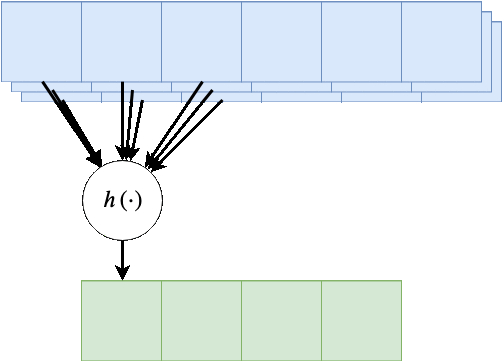
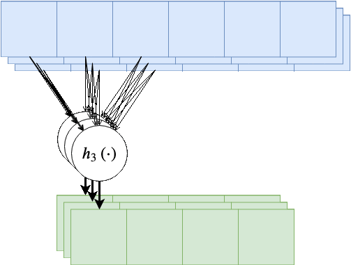
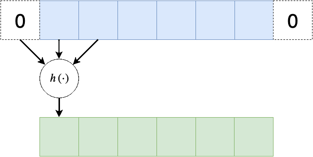
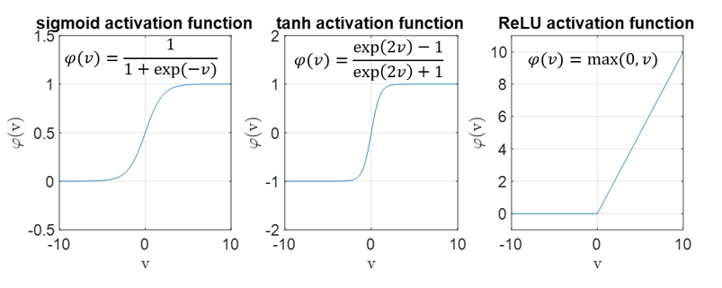

<section markdown="1">

### Convolutional Neural Networks (CNN) - רשתות קונבולוציה

 

- מודל MLP (Fully Connected (FC) network) אינו רגיש לסדר בכניסה לרשת.  
- לפעמים תכונה זו הינה רצויה, אך באה במחיר של מספר רב של פרמטרים.  
- במקרים בהם למידע יש מבנה מרחבי (לדוגמא תמונות) נרצה לנצל זאת.  
- רשתות קונבולציה הינם סוג אחד רשתות feed-forward בעלת ארכיטקטורה אשר מנצלת תכונה זו.

</section><section markdown="1">

#### 1D Convolutional Layer

שכבת קונבולוציה חד-ממדית מבצעת פעולת קרוס קורלציה בין וקטור הכניסה $$\boldsymbol{x}$$ ווקטור משקולות $$\boldsymbol{w}$$ באורך $$K$$:

$$
\boldsymbol{y}\left[n\right]=\sum_{m=0}^{K-1} \boldsymbol{x}\left[n+m\right]\boldsymbol{w}\left[m\right]
$$

- וקטור המשקולות נקרא **גרעין הקונבולוציה (convolution kernel)**

**הערה:** שכבת קונבולוציה מחשבת קרוס-קורלציה, ולא קונבולוציה ($$\boldsymbol{y}\left[n\right]=\sum_{m=0}^{K-1} \boldsymbol{x}\left[n-m\right]\boldsymbol{w}\left[m\right]$$).

</section><section markdown="1">

#### 1D Convolutional Layer - המשך

באופן גרפי:

{: width="450px"}

$$
\boldsymbol{y}\left[n\right]=\sum_{m=0}^{K-1} \boldsymbol{x}\left[n+m\right]\boldsymbol{w}\left[m\right]
$$

</section><section markdown="1">

#### 1D Convolutional Layer - המשך 2

הבדלים מרשת FC:

1. היציאות מחוברות רק לחלק מהכניסות, כאשר הכניסות קרובות אחת לשניה  
2. כל היציאות מופקות מאותן משקולות

 

ההנחות הארכיטקטורה:

- הקשר בין כניסות קרובות הוא יותר חזק ומשמעותי מאשר כניסות רחוקות.  
- אזורים שונים בכניסה מתנהגים באופן דומה.  

 

בשכבת FC קיימות $$N_\text{inputs}\times N_\text{outputs}$$ משקולות בעוד שלשכבת קונבולציה יש $$K$$ משקולות.

</section><section markdown="1">

#### 1D Convolutional Layer - המשך 3

דרך נוספת להצגת שכבת קונבולוציה:

{: width="700px"}

- $$h\left(\boldsymbol{z}\right)=\boldsymbol{w}^T\boldsymbol{z}=w_1z_1+w_2z_2+w_3z_5+b$$
- $$b$$ היינו איבר ההסט.

</section><section markdown="1">

#### אקטיבציה לא לינארית

בדומה לשכבות FC, נעשה שימוש בפונקציות אקטיבציה לא לינאריות.

פונקציית האקטיבציה הנפוצה ביותר הינה ReLU: $$\varphi\left(x\right)=\max\left(x,0\right)$$.

</section><section markdown="1">

#### קלט רב-ערוצי

נרצה לרוב ששכבת הקונבולציה תקבל קלט רב ערוצי. לדוגמא:

- תמונה בעלת שלושה ערוצי צבע.
- שמע ממספר ערוצי הקלטה.

במקרים אלו הניורון $$h$$ יהיה פונקציה של כל ערוצי הקלט:

{: width="700px"}

</section><section markdown="1">

#### פלט רב-ערוצי

נרצה לרוב להשתמש ביותר מגרעין קונבולוציה אחד לקבלת מספר ערוצים במוצא:

{: width="600px"}

- בשכבות אלו אין שיתוף של משקולות בין ערוצי הפלט השונים.
- מספר הפרמטרים בשכבת כזאת היינו:  $$\underbrace{C_\text{in}\times C_\text{out}\times K}_\text{the weights}+\underbrace{C_\text{out}}_\text{the bias}$$

כאשר:

- $$C_\text{in}$$ - מספר ערוצי קלט.
- $$C_\text{out}$$ - מספר ערוצי פלט.
- $$K$$ - גודל הגרעין.

<!-- **דגש:** שימו לב, יש להבדיל בין מס' הערוצים לממד הקלט/פלט. נגיד עבור ערוץ אחד אנחנו יכולים לקבל קלט רב ממדי (נגיד תמונה) ועבור פלט רב ערוצי, עבור כל ערוץ אנחנו יכולים לקבל מס' ממדים עבור כל ערוץ -->

</section><section markdown="1">

#### היפר-פרמטרים של שכבות קונבולוציה

בנוסף לפהיפר-פרמטרים **גודל הגרעין** ו **מספר ערוצי הפלט**, מקובל להגדיר גם את הפרמטרים הבאים:

 

##### Padding - ריפוד

ניתן לרפד את וקטור הכניסה באפסים על מנת לשמר את אורך הוקטור במוצא:

{: width="700px"}

</section><section markdown="1">

#### היפר-פרמטרים של שכבות קונבולוציה - המשך

##### Stride - גודל צעד

ניתן לבצע את הקונבולוציה בדילוגים על מנת לדלל את המוצא. לרוב גודל הצעד מסומן ב $$s$$. בדוגמא הבאה גודל הצעד היינו $$s=2$$ .

{: width="700px"}

</section><section markdown="1">

#### היפר-פרמטרים של שכבות קונבולוציה - המשך 2

##### Dilation - התרחבות

על מנת להקטיןן עוד את מספר הפרמטרים, ניתן לדלל את המשקולות בגרעין הקונבולוציה. פעולה זו נקראת הרחבה (dilation) של הקונבולוציה. לרוב נסמן את ההתרחבות ב $$d$$ בדוגמא הבאה $$d=2$$.

{: width="700px"}

</section><section markdown="1">

#### Max Pooling

- לרוב ב CNN נעשה שימוש בשכבת נוספות על מנת לצמצם את גודל הקלט.
- שכבה לדוגמא היינה שכבת Max Pooling.
- שכבה זאת לוקחת את המקסימום מבין ערכי הכניסה.
- המוטיבציה לפעולה זאת היינה שהערכים הגבוהים מייצגים מאפיינים בעלי יותר אינפורמציה.

לדוגמא Max Pooling בגודל 2 עם גודל צעד (stride) 2:

{: width="700px"}

בשכבה זאת אין פרמטרים נלמדים, אך גודל הגרעין היינו היפר-פרמטר נוסף.

</section><section markdown="1">

#### 2D Convolutional Layer

ניתן באופן דומה להגדיר שכבות קונבולוציה בעבור מימדים שונים מ1. לדוגמאת קונבולוציה דו-מימדית, במקרה זה הכניסות והיציאות יהיו מטריצות.

כמה דוגמאות לקונבולוציות (השכבה הכחולה היא הקלט והשכבה הירוקה היא הפלט):

<table style="width:100%; table-layout:fixed;">
  <tr>
    <td>
kernel size=3 padding=0 stride=1 dilation=1
</td>
    <td>
kernel size=4 padding=2 stride=1 dilation=1
</td>
    <td>
kernel size=3 padding=1 stride=1 dilation=1 (Half padding)
</td>
    <td>
kernel size=3 padding=2 stride=1 dilation=1 (Full padding)
</td>
  </tr>
  <tr>
    <td></td>
    <td></td>
    <td></td>
    <td></td>
  </tr>
  <tr>
    <td>
kernel size=3 padding=0 stride=2 dilation=1
</td>
    <td>
kernel size=3 padding=1 stride=2 dilation=1
</td>
    <td>
kernel size=3 padding=1 stride=2 dilation=1
</td>
    <td>
kernel size=3 padding=0 stride=1 dilation=2
</td>
  </tr>
  <tr>
    <td></td>
    <td></td>
    <td></td>
    <td></td>
  </tr>
</table>

- \[1\] Vincent Dumoulin, Francesco Visin - [A guide to convolution arithmetic for deep learning](https://arxiv.org/abs/1603.07285)([BibTeX](https://gist.github.com/fvisin/165ca9935392fa9600a6c94664a01214))
  
</section><section markdown="1">

## תרגילים

#### תרגיל 10.1

נתונה רשת קונבולוציה קטנה, הממירה תמונה בגודל 13×13 לווקטור מוצא בגודל 4×1. הרשת מורכבת מהפעולות הבאות:

{: width="450px"}

 

- שכבת קונבולוציה עם 3 פילטרים (גרעינים) בגודל 4x4
- פונקציית אקטיבציה Relu
- max pooling
- שכבת Fully-connected (FC)

ברשת זאת אין שימוש בbias.

</section><section markdown="1">

#### תרגיל 10.1 - המשך

{: width="450px"}

א) כמה פרמטרים נלמדים יש בשכבת הקונבולוציה

ב) כמה פעולות אקטיבציה מבוצעות (Relu) במעבר קדמי אחד (forward pass)?

ג) כמה משקולות יש בכל הרשת?

ד) האם רשת בקישוריות מלאה (FC) בעלת גודל שכבות זהה – כלומר רשת זהה שבה שכבת הקונבולוציה מוחלפת בשכבת FC, יכולה לייצג את אותה הפונקציה אותה ממשת הרשת המקורית?

ה) מה ההבדל העיקרי בין רשת CNN ל FC שיכולות לייצג את אותו מסווג?

</section><section markdown="1">

#### תרגיל 10.1 - המשך 2

{: width="450px"}

א) כמה פרמטרים נלמדים יש בשכבת הקונבולוציה

##### פתרון

א) סה"כ 48 פרמטרים. קיימים 3 פילטרים בגודל 4×4, לכן 3⋅4⋅4=48.

</section><section markdown="1">

#### תרגיל 10.1 - המשך 2

{: width="450px"}

ב) כמה פעולות אקטיבציה מבוצעות (Relu) במעבר קדמי אחד (forward pass)?

##### פתרון

ב) מבוצעות 304 פעולות Relu. פעולת האקטיבציה מתבצעת לכל מאפיין במוצא שכבת הקונבולוציה ועוד 4 במוצא שכבת הFC. כלומר: $$10 \cdot 10 \cdot 3 + 4 =304$$

</section><section markdown="1">

#### תרגיל 10.1 - המשך 2

{: width="450px"}

ג) כמה משקולות יש בכל הרשת?

##### פתרון

ג) 348 פרמטרים. נפרט את החישוב. בשכבת הקונבולוציה יש 48 פרמטרים (סעיף א), בשכבת הFC יש $$3\times 5\times 5$$ כניסות שמחוברות ל $$4$$ יציאות, סה"כ $$3\times 5\times 5\times 4=300$$.

</section><section markdown="1">

#### תרגיל 10.1 - המשך 2

{: width="450px"}

ד) האם רשת בקישוריות מלאה (FC) בעלת גודל שכבות זהה – כלומר רשת זהה שבה שכבת הקונבולוציה מוחלפת בשכבת FC, יכולה לייצג את אותה הפונקציה אותה ממשת הרשת המקורית?

##### פתרון

ד) כן, הרשת עם שכבת הקונבולוציה הינה מקרה פרטי של רשת FC, עם בחירה ספציפית של המשקולות.

</section><section markdown="1">

#### תרגיל 10.1 - המשך 2

{: width="450px"}

ה) מה ההבדל העיקרי בין רשת CNN ל FC שיכולות לייצג את אותו מסווג?

##### פתרון

ה) הרשת עם שכבת הקונבולוציה מתארת תת-תחום של מרחב הפונקציות שאותה יכולה לתאר רשת הFC. היתרון שברשת עם שכבת הקונבולוציה הינה שהיא עושה זאת על ידי מספר קטן משמעותית של פרמטרים. לכן, בהנחה שניתן לקרב במידה טובה מספיק את פונקצייית המטרה על ידי פונקציות מתת-תחום זה, היא תגרום פחות לoverfit ולכן בעלת סיכוי להניב תוצאות טובות יותר. לשם השוואה ברשת הFC ישנם כ50k פרמטרים.

</section><section markdown="1">

#### תרגיל 10.2

התמך או הrecptive field של משתנה מסויים ברשת מוגדר להיות כל התחום בכניסה אשר משפיע על אותו המשתנה.

א) מצאו את הrecptive field של ערך מסויים במוצא של שלוש שכבות קונבולוציה רצופות עם גרעין של $$3\times 3$$.

ב) רשמו באופן מטריצי את פעולת הקונבולוציה.

</section><section markdown="1">

#### תרגיל 10.2 - פתרון

א) הrecptive field של שלוש שכבות קונבולוציה $$3\times 3$$ הינו $$7\times 7$$:

</section><section markdown="1">

#### תרגיל 10.2 - פתרון - המשך

ב. נרשום את הפילטרים ככפל מטריצות, עבור הפילטר הראשון:

$$
w^1 = 
\begin{pmatrix}
w_1 & w_2 & w_3 & 0 & \cdots & 0 & w_4 & w_5 & w_6 & 0 & \cdots \\
0 & w_1 & w_2 & w_3 & 0 & \cdots & 0 & w_4 & w_5 & w_6 &  \cdots \\
\vdots & \vdots \vdots  & \vdots & \vdots & \vdots & \vdots & \vdots & \vdots & \vdots & \vdots 
\end{pmatrix}
\in \mathbb{R}^{d_1\times d_0 = 25 \times 49}
$$

ובאופן זהה עבור פילטר מס' שתיים ושלוש.

$$
w^2 \in \mathbb{R}^{d_2\times d_1 = 9 \times 25} 
$$

$$
w^3 \in \mathbb{R}^{d_3\times d_2 = 1 \times 9}
$$

נרשום את הקלט בצורה וקטורית: $$ x = (x_1, \cdots, x_{49})^T$$

וסה"כ נקבל:
$$
y=w^3 w^2 w^1 x
$$

</section><section markdown="1">

## סכמות אתחול

### מוטיבציה

ראינו בתרגול 8 שבחירה לא טובה של האתחול יכולה להוביל לכך שפונקציית האקטיבציה תהיה ברוויה והעדכון של המשקולות יהיה איטי ולא אפקטיבי:

 

- בעבור משקולות קטנות, האות דועך בין שכבה לשכבה ולא מחלחל לשכבות ראשונות. (vanishing gradients).  
- בעבור משקולות גדולות, האות גדל בין שכבה לשכבה מה שיכול לגרום לחריגה מתחום ייצוג. (exploding gradients).

</section><section markdown="1">

## סכמות אתחול

{: width="500px"}

{: width="500px"}

- ניתן לראות באיורים כי האות לא מפעפע בצורה טובה דרך הרשת:
    - באיור הראשון אנו רואים כי ככל שמתקדמים לעומק הרשת האקטיבציות דועכות, כלומר, יש יותר אקטיבציות עם ערכים מאוד קרובים לאפס.
    - באיור השני אנו רואים את הבעיה של vanishing gradients שלמדנו בתרגול הקודם.
    
</section><section markdown="1">

### המטרה:

נרצה למצוא אתחול טוב של המשקולות אשר יאפשר לאות לפעפע דרך הרשת בצורה טובה.

#### תרגיל 10.3

בשאלה זו נרצה למצוא סכמת אתחול עבור משקולות הרשת. לשם כך, נתחיל מלבחון נוירון ליניארי בודד.

**הערה**: אם הממוצע של המוצא $$v$$ הוא 0 והשונות נשארת קבועה בין שכבות (לא דועכת או מתפוצצת) – אין התפוצצות או העלמות של האות לאורך הרשת. לכן, בסעיפים הבאים נתעניין בחישוב הממוצע והשונות של המוצא $$v$$.
 ספציפית: נרצה להראות כי $$Ev=0$$ ואז לחשב את השונות של המוצא על מנת לראות מה עלינו לדרוש על אתחול המשקולות על מנת להבטיח כי שונות המוצא תישאר קבועה לאורך הרשת.

</section><section markdown="1">

#### תרגיל 10.3

**א)** נניח כי כל רכיבי המשקולות וכל רכיבי הכניסה הם משתנים אקראיים IID. בנוסף, נניח כי התפלגות המשקולות סימטרית סביב 0.

1. חשבו את התוחלת של המוצא v כתלות בתוחלות של המשקולות והכניסה. בפרט, הראו כי $$Ev=0$$.
2. הראו כי לכל זוג משתנים אקראיים בלתי תלויים $$w_i,x_i$$ מתקיים:
$$ Var(w_i x_i )=(Ew_i )^2 Var(x_i )+(Ex_i )^2 Var(w_i )+Var(x_i )Var(w_i ) \quad (*) $$
3. כעת, נניח כי לכל $$i$$: $$Ex_i=0$$ (בסעיף הבא נראה הצדקה להנחה זו).
השתמשו בנוסחה מהסעיף הקודם על מנת לבטא את השונות של $$v$$ באמצעות השונות של $$x_1,w_1$$.
4. כיצד ניתן לשמור על השונות של המוצא v זהה לשונות של כל אחת מרכיבי הכניסה $$x_i$$?

</section><section markdown="1">

#### תרגיל 10.3

**ב)** כעת, נרצה להרחיב את הסכמה לנוירונים **לא ליניאריים**:

כלומר, כעת מתקיים כי $$x_i=\sigma(y_i ), \forall i=1, \dots,n$$
כאשר $$sigma (\cdot)\$$  (היא פונקציית האקטיבציה ו-
$$v=w_1 x_1+w_2 x_2+⋯+w_n x_n$$

אנו נניח כי ניורון זה הוא חלק מרשת עמוקה, כלומר, נניח כי $$y_1,\dots,y_n$$ הם המוצאים של ניורונים מהשכבה הקודמת ברשת.
**הערה:** בסעיף הבא נראה כי התוחלת של המוצא איננה 0 עבור אחת מהאקטיבציות שלמדנו בקורס. עם זאת, נראה כי הממוצע לפני האקטיבציה, כלומר, הממוצע של $$y_i$$,
 הוא עדיין 0 לכל i. לכן, אין לנו בעיה של התפוצצות הממוצע $$\leftarrow$$ אם השונות נשארת קבועה בין שכבות (לא דועכת או מתפוצצת) – אין התפוצצות או העלמות של האות לאורך הרשת.

</section><section markdown="1">

#### תרגיל 10.3

1. לאילו מפונקציות האקטיבציה שלמדנו בקורס (sigmoid, tahn ו-ReLU) ההנחה $$Ex_i=0$$ שביצענו בסעיף הקודם היא עדיין הנחה "סבירה"? תזכורת:
  
2. כעת לא נניח דבר על התוחלת של  $$x_i$$. כיצד ישתנה הביטוי של השונות של  $$v$$ מסעיף א.3?
3. עבור פונקציית האקטיבציה ReLU, בטאו את השונות של $$v$$ באמצעות השונות של אחת הכניסות $$y_i$$. הניחו כי $$Var(y_1 )=Var(y_2 )=\cdots=Var(y_n)$$ 

הדרכה: היעזרו בתוצאות הסעיפים הקודמים.

</section><section markdown="1">

#### תרגיל 10.3

## פתרון:

**א.**

1.

  $$
  Ev=E[w_1 x_1+w_2 x_2+⋯+w_n x_n ]=nE[w_1 x_1 ]=nE[w_1 ]E[x_1 ]=0
  $$

</section><section markdown="1">

#### תרגיל 10.3

## פתרון:

**א.**

2.
  נעזר בקשר $$Var(z)=Ez^2-(Ez)^2$$ שמתקיים עבור כל משתנה אקראי $$z$$ ובעובדה שנתון כי $$w_i,x_i$$  בלתי תלויים. נקבל באגף השמאלי של (*):

  $$
  (Ew_i )^2 Var(x_i )+(Ex_i )^2 Var(w_i )+Var(x_i )Var(w_i )
  $$

  $$
  =(Ew_i )^2 (Ex_i^2-(Ex_i )^2 )+(Ex_i )^2 (Ew_i^2-(Ew_i )^2 )+(Ex_i^2-(Ex_i )^2 )(Ew_i^2-(Ew_i )^2 )
  $$

  $$
  =(Ew_i )^2 Ex_i^2-(Ew_i )^2 (Ex_i )^2+(Ex_i )^2 Ew_i^2-(Ew_i )^2 (Ex_i )^2+Ew_i^2 Ex_i^2
        -(Ew_i )^2 Ex_i^2-Ew_i^2 (Ex_i )^2+(Ew_i )^2 (Ex_i )^2
  $$

  $$
  =Ew_i^2 Ex_i^2-(Ew_i )^2 (Ex_i )^2
  $$

  משילוב שתי התוצאות קיבלנו את התוצאה הרצויה:

  $$
  Var(w_i x_i )=(Ew_i )^2 Var(x_i )+(Ex_i )^2 Var(w_i )+Var(x_i )Var(w_i )
  $$

</section><section markdown="1">

#### תרגיל 10.3

## פתרון:

**א.**

3.
  תחת ההנחה כי התוחלות של המשקולות ושל הכניסה הן 0, הנוסחה שהוכחנו בסעיף הקודם מצטמצמת ל-
  $$
  Var(w_i x_i )=Var(x_i )Var(w_i )
  $$
  בנוסף, עבור מוצא הניורון v ניתן לכתוב:
  $$
  v=w_1 x_1+w_2 x_2+⋯+w_n x_n
  $$  
  מכיוון שהנחנו שכל המשתנים מפולגים IID נקבל:
  $$
  Var(v)=nVar(w_1 x_1 )=nVar(w_1 )Var(x_1 )
  $$

</section><section markdown="1">

#### תרגיל 10.3

## פתרון:

**א.**

4.
  קיבלנו בסעיף הקודם כי שונות המוצא הוא שונות הכניסה מוכפל בפקטור של 
  $$nVar(w_i )$$ כאשר $$n$$ הוא מספר הניורונים המוזנים לניורון. לכן, על מנת לשמור על שונות זהה בין כניסה למוצא נבחר את אתחול המשקולות כך שיתקיים:

  $$
  Var(w_i )= \frac{1}{n}
  $$

</section><section markdown="1">

#### תרגיל 10.3

## פתרון:

**ב.**

1.
  אם התפלגות המשקולות סימטרית סביב 0, נקבל כי התפלגות $$y_i$$ סימטרית סביב 0 לכל $$i$$. לכן, ההנחה עדיין סבירה עבור tanh אך לא עבור ReLU וsigmoid, עבור tanh נקבל:
  
  $$
  Ex=E[\sigma(y)]=\int_{-\infty}^{\infty} \sigma(y) f_Y (y)dy=0
  $$
  
  כאשר סימנו $$x=x_i,y=y_i$$.

</section><section markdown="1">

#### תרגיל 10.3

## פתרון:

**ב.**

2.
  משימוש בתוצאות הסעיפים הקודמים, נקבל:
  
  $$
  Var(v)=nVar(w_1 x_1 )=n((Ew_1 )^2 Var(x_1 )+(Ex_1 )^2 Var(w_1 )+Var(x_1 )Var(w_1 ))
  $$
  
  $$
  =nVar(w_1 )((Ex_1 )^2+Var(x_1 ))=nVar(w_1 )Ex_1^2
  $$

</section><section markdown="1">

#### תרגיל 10.3

## פתרון:

**ב.**

3.
  אם התפלגות המשקולות סימטרית סביב 0, נקבל כי התפלגות $$y_i$$ סימטרית סביב 0 לכל $$i$$. לכן, עבור פונקציית אקטיבציה ReLU נקבל:
  
  $$
  Ex_1^2=E((max ((0,y_1 ) )^2 ) = \int_{-\infty}^{\infty} (max (0,y_1 ) )^2 f_Y (y)dy
  $$
  
  $$
  =\int_{0}^{\infty} y_1^2 f_Y (y)dy = \frac{1}{2} \int_{-\infty}^{\infty} y_1^2 f_Y (y)dy = 1/2 Ey_1^2= \frac{1}{2} Var(y_1 )
  $$
  
  נשלב את התוצאה יחד עם תוצאות הסעיפים הקודמים ונקבל:
  
  $$
  Var(v)=nVar(w_1 )Ex_1^2= \frac{n}{2} Var(w_1 )Var(y_1 )
  $$
  
  לכן, על מנת לשמור על שונות זהה בין כניסה למוצא נבחר את אתחול המשקולות כך שיתקיים:
  
  $$
  Var(w_i )= \frac{2}{n}
  $$

</section><section markdown="1">

## חלק מעשי

### LeNet-5
בחלק זה נעבור על היישום המעשי הראשון של רשתות קונבולוציה. הארכיטקטורה זאת שימשה ב1998 ושימש לזהות ספרות בכתב יד על צק'ים במערכות בנקאיות.

הרשת מקבלת תמונה רמת אפור בגודל 32x32 ומשתמש באריטקטורה הבאה על מנת להוציא וקטור פלט באורך 10 אשר מציג את הסבירות שהתמונה שייכת לכל אחת מ 10 הספרות.  

</section><section markdown="1">

###  אריכטקטורה
{: width="100%"}

אם לא צויין אחרת הארכיטקטורה לא עושה שימוש בריפוד ו-dilation. 

- C1: Convolutional layer + ReLU activation: kernel size=5x5, output channels=6.
- S2: Max pooling layer: size=2x2, stride=2
- C3: Convolutional layer + ReLU activation: kernel size=5x5, output channels=16.
- S4: Max pooling layer: size=2x2, stride=2
- C5: Convolutional layer + ReLU activation: kernel size=5x5, output channels=120. (this is, in fact, a fully connected layer)
- F6: Fully connected layer + ReLU: output vector length= 84
- Output layer: Fully connected layer: output vector length=10

על מנת לייצג הסתברות שהתמונה שייכת לאחת מהמחלקות נעשה ביציאה שימוש בשכבת Softmax, שלא נרחיב עליה בקורס.

</section><section markdown="1">

### Dataset: MNIST
.לאימון הרשת נעשה שימוש במאגר המידע MNIST. הוא סט פופולרי מאוד שנעשה בו שימוש נרחב עד היום. הסט מורכב 70000  תמונות בינאריות בגודל 28x28 של ספרות בכתב יד, מתוכן 10000 הינם בסט המבחן.

ניתן להוריד את הסט מ
[Yann LeCun's web site](http://yann.lecun.com/exdb/mnist/) 
 או לחילופין, ישרות מ -PyTorch
 [torchvision.datasets.MNIST](https://pytorch.org/docs/stable/torchvision/datasets.html#mnist)
 
</section><section markdown="1">

### דוגמא מתוך המאגר 

Number of rows in the train dataset: $$N=60000$$

Number of rows in the test dataset: $$N=10000$$

Image size: 28x28

Pixels value range: [0.0, 1.0]

</section><section markdown="1">

## 📜 הגדרת הבעיה 

- המשתנים בבעיה:
  - תמונה בגודל 28x28 של סיפרה בכתב יד - $$x$$
  - ערך הסיפרה: \[0-9\] - $$y$$

המודל יהיה החזאי $$\hat{y}=h^*\left(\boldsymbol{x}\right)$$ שתפקידו למזעזר את פונקציית המחיר misclassification rate:

$$
h^*=\underset{h}{\arg\min}\ E\left[I\left\lbrace h\left(\boldsymbol{x}\right)\neq y\right\rbrace\right]
$$

</section><section markdown="1">

### 📚 חלוקה של מאגר המידע
משום שהמאגר המידע מחולק כבר לסט מבחן, כל מה שנותר לנו הוא לחלק את סט האימון לסט ולידציה וסט אימון.
אין צורך לקחת סט ולידציה גדול משום שהרצת המודל על סט גדול דורשת הרבה משאבים, נקח סט קטן בגודל 1024 על מנת להעריך את ביצועי המודל בתהליך הלמידה באופן מהיר וחסכוני.

</section><section markdown="1">

## 💡 אלגוריתם למידה 

נשתמש באלגוריתם הגרדיאנט בגרסת ה-mini-batch, או בשמו stochastic gradient descent (SGD), המשמעות הסטוכנסטית היינה שהBatch מוגרל באופן אחיד מתך מאגר המידע.
האלגוריתם ישמש למציאת משקולות הרשת להקטנת פונקצית המחיר.

תזכורות: משקולות הרשת הינם המשקולות בגרעיני קונבולוציה, בשכבות FC ואיברי ההסט.

</section><section markdown="1">

### Hyper-parameters

- הארכיטקטורה של הרשת, שבה לא נעשה כל שינוי.
- אלגוריתם SDG:
  - גודל צעד הלימוד.
  - גודל הBatch, אשר אותו נשאיר קבוע בגודל 64.
  - מס' מקסימלי של epochs. 
    epochs - מס המעברים על כל סט האימון

</section><section markdown="1">

## ⚙️ Learning

### Selecting the Learning Rate

נבחן את השפעת גדלי צעד לימוד על תהליך הלימוד.
נריץ את האלגוריתם למשך epoch אחד עם הגדלים הבאים: $$\alpha=10^{0},10^{-1},10^{-2}$$
{: width="75%"}

קיבלנו שעבור $$\alpha=10^{0}$$ המערכת לא מצליחה לבצע למידה (להקטין את פונקציית המחיר). ניתן להגיד שצעד הלימוד גדול מידי משום שעבור צעד לימוד קטן יותר המערכת כן מצליחה ללמוד.

כמו כן עבור $$\alpha=10^{-1}$$ קיבלנו תהליך התכנסות מהיר הרבה יותר ולמחיר נמוך יותר על פני $$10^{-2}$$. לכן נבחר את גודל הצעד להיות $$\alpha=10^{-1}$$   

</section><section markdown="1">

## Training
נריץ את באלגוריתם עבור גודל צעד $$\alpha=10^{-1}$$ למשך 20 epochs.

נראה שמודל התכנס יפה, משום שמחיר על סט הולידציה הגיע למישור. ניתן להניח שהמודל הגיע למינימום מקומי (אבל לא ניתן לדעת בוודאות)

</section><section markdown="1">

## ⏱️ הערכת ביצועים#
נריץ את המודל לאחר הלימוד על סט המבחן ונקבל שפונקצית המחיר היינה

The test risk is: $$0.0091$$

קיבלנו  misclassification rate של כמעט אחוז בודד, כלומר שעבור אחוז מסט המבחן טעינו בחיזוי הסיפרה או לחילופין צדקנו ב99% מסט המבחן. 

</section>
