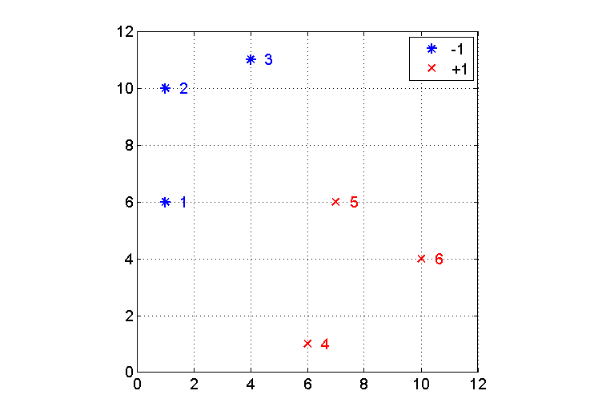
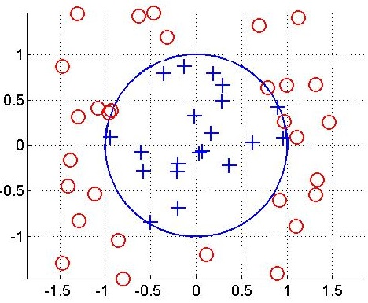
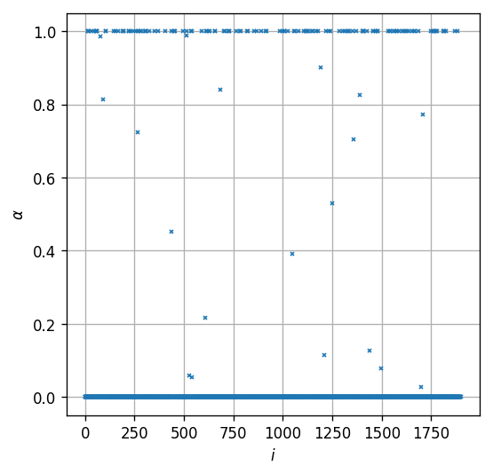




עסקנו בתרגולים קודמים בסיווג לינארי - מציאת מישור לינארי אשר מפריד בין המחלקות.

עם זאת, למעשה ניתן למצוא אינסוף מישורי הפרדה כאלה במקרה הלא לינארי.

SVM הינו אלגוריתם סיווג לינארי המבוסס על הרעיון לבחור את מישור ההפרדה אשר ממקסם את השוליים (Margin) בין המחלקות, בכיוון המאונך למישור ההפרדה.

<br>

## תזכורת - גאומטריה של המישור

<br>

* משוואה של מישור ב- $$\mathbb{R}^d$$ הינה $$w^Tx+b=0$$, עבור $$w\in\mathbb{R}^d$$ ו- $$b\in\mathbb{R}$$, קבועים המגדירים את המישור.

* מרחק אוקלידי של נקודה $$x_0$$ מהמישור הינו:

  

$$
d=\frac{w^Tx_0+b}{\lVert w \rVert}
$$


<br>

### Hard SVM

<br>

בעיית אופטימיזציה זו מתאימה למקרה ששתי המחלקות ניתנות להפרדה לינארית.

<br>

ניתן להראות שבחירת ה- Margin המקסימלי שקולה לפתרון בעיית האופטימיזציה הבאה, אשר מכונה הבעיה הפרימאלית:


$$
\boldsymbol{w}^*,b^*=\underset{\boldsymbol{w},b}{\arg\min} \frac{1}{2}\left\lVert\boldsymbol{w}\right\rVert^2 \\
\begin{align*}
\text{s.t.}\quad y_i\left(\boldsymbol{w}^T\boldsymbol{x}_i+b\right)\geq1\quad&\forall i
\end{align*}
$$


* נשים לב, שהאילוץ $$y_i\left(\boldsymbol{w}^T\boldsymbol{x}_i+b\right)\geq 1 $$ דורש שכל הנקודות יסווגו נכון על ידי המסווג הלינארי.


ניתן להראות שבעית האופטימיזציה הבאה, אשר נקראת הבעיה הדואלית, שקולה לבעיה לעיל:


$$
\left\lbrace\alpha_i\right\rbrace^*=\underset{\left\lbrace\alpha_i\right\rbrace}{\arg\max} \sum_i\alpha_i-\frac{1}{2}\sum_{i,j}y_iy_j\alpha_i\alpha_j\left<\boldsymbol{x}_i,\boldsymbol{x}_j\right> \\
\begin{align*}
\text{s.t.}\quad&\alpha_i\geq0\quad&\forall i\\
&\sum_i\alpha_iy_i=0
\end{align*}
$$


כאשר, נחזור לפתרון המשקולות על ידי הקשר הבא בין $$\alpha$$ ו- $$w$$,


$$
\boldsymbol{w}=\sum_i\alpha_iy_i\boldsymbol{x}_i\\
$$


הבעיה הדואלית מדגישה תכונה מעניינת של הפתרון:

בעת פתרון בעית האופטימיזציה, כל דוגמא מסט הלימוד תציית לאחד מהתנאים הבאים:

1. $$\alpha_i=0$$ and $$y_i\left(\boldsymbol{w}_i^Tx_i+b\right)>1$$
2. $$\alpha_i>0$$ and $$y_i\left(\boldsymbol{w}_i^Tx_i+b\right)=1$$

<br>

מהמשוואה $$\boldsymbol{w}=\sum_i\alpha_iy_i\boldsymbol{x}_i$$, ניתן להסיק שרק דוגמא $$x_i$$ שעבורה מתקיים $$\alpha_i>0$$ , משתתפת בהגדרת הערך של $$w$$. נקודות אלה נקראות וקטורי תמיכה (Support Vectors) ובמקרה הכללי, המספר שלהם יהיה נמוך.

<br>

### תכונות ה- Support Vectors

1. מרחקן למישור המפריד הוא מינימלי.
2. $$\alpha_i>0$$ אם ורק אם $${{x}_{i}}$$ היא SV.

3. אם $${{x}_{i}}$$ היא SV, מתקיים $${{y}_{i}}({{w}^{T}}{{x}_{i}}+b)=1$$ 
   (הכיוון ההפוך לא בהכרח מתקיים, כלומר יכולה להיות דוגמה $${{x}_{j}}$$ עבורה השוויון הנ"ל מתקיים אך $$\alpha_j=0$$).

4. המרחק האוקלידי של ה SV מהמישור המפריד נקרא ה- margin של הבעיה, והוא שווה ל $$\frac{1}{||w||}$$ 
   (**תרגיל**: הוכיחו את הביטוי הנ"ל, בעזרת הביטוי למרחק נקודה ממישור ותכונה מס' 3).

<br>

## שאלה 1 - דוגמאות ניתנות להפרדה לינארית

 <br>

נתונות שתי המחלקות הבאות:

מחלקה 1:  $$[1,6],[1,10],[4,11] $$ ($$y_k=-1$$)

מחלקה 2: $$[6,1], [7,6],[10,4]$$  ( $$y_k=+1$$)





א.   צייר את מסווג ה-SVM  הלינארי לבעיה זו? מהם וקטורי התמיכה (support vectors)?


ב.   נתון כי הערכים האופטימליים של הבעיה הדואלית הם:


$$
\alpha ={{\left[ \begin{matrix}
  \text{0}\text{.0356} & 0 & \text{0}\text{.04} & 0 & \text{0}\text{.0756}\begin{matrix}
  {} & 0 \\
\end{matrix} \\
\end{matrix} \right] }^{T}}
$$
​		

​		לאילו דוגמאות שייכים הערכים השווים לאפס?


ג.    חשב את ערך הווקטור w האופטימאלי של הבעיה הפרימאלית? 


ד.   מהו  ה-margin של הבעיה?


ה.  חשב את ה-margin  ישירות מערכי $$\alpha_i$$.

 

**פתרון**

​    א.    נבדוק מה המספר האפשרי $${{n}_{SV}}$$ של ווקטורי תמיכה  בבעיה זו:

1. $${{n}_{SV}}=0$$: <br>
   אפשרי באופן עקרוני, אם כל הנקודות בסט הלימוד שייכות רק למחלקה אחת. הפתרון האופטימלי המתקבל הוא $$\forall i:{{\alpha }_{i}}=0\to w=0$$. מצב זה לא מתקיים בסט הלימוד הנתון בשאלה.

   

2. $${{n}_{SV}}=1$$:<br>
   לא אפשרי במקרה הכללי, שכן אי אפשר לקיים את התנאי $$\sum\limits_{i}{{{\alpha }_{i}}}{{y}_{i}}=0$$ עם $$\alpha_i$$ אחד בלבד ששונה מ- 0. **היוצא מהכלל** הוא מקרה פרטי בו אנו מאלצים את המישור המפריד לעבור בראשית, כלומר  קובעים $$b=0$$. במצב זה $$b$$ אינו מופיע בבעית האופטימיזציה, ולא נקבל את התנאי $$\sum\limits_{i}{{{\alpha }_{i}}}{{y}_{i}}=0$$. השאלה דנה במקרה הכללי ולכן לא נבדוק את המקרה הזה.

   

3. $${{n}_{SV}}=2$$: <br>
   אפשרי. במקרה זה הווקטור $$w$$ ניצב לקו המחבר את ווקטורי התמיכה. זוגות אפשריים הן הנקודות (ראו ציור) $$\{1,4\};\{1,5\};\{3,4\};\{3,5\}$$. ע"י בדיקה רואים שכל הזוגות מובילים לסתירה עם ההנחה שהם ווקטורי תמיכה, שכן עבור כל זוג קייימת נקודה אחרת שיותר קרובה למישור המפריד, בסתירה לתכונות ה- SV.

   

4. $${{n}_{SV}}=3$$:<br>
   אפשרי. השלשות המועמדות הן נקודות $$\{1,3,5\}$$ או $$\{3,4,5\}$$. עבור כל שלשה ניתן לפתור עבור $$w,b$$ תוך שימוש באילוץ $${{y}_{i}}({{w}^{T}}x+b)=1$$ (שמתקיים בשוויון עבור ה- SV). הצבת 3 נקודות תיתן 3 משוואות ב 3 נעלמים, ונקבל פתרון יחיד לנעלמים $$w$$ ו- $$b$$.

   

   מקבלים:
   
   

$$
\{1,3,5\}:\quad w=\frac{1}{15}\left[\begin{matrix} & 5 \\ & -3 \\ \end{matrix} \right],b=-\frac{2}{15} \\
$$


$$
\{3,4,5\}:\quad w=\frac{1}{10}\left[\begin{matrix} & 5 \\ & -1 \\ \end{matrix} \right],b=-\frac{19}{10}
$$

​			

והפתרון האופטימלי הוא השלשה עם $$\left\| w \right\|$$ מינימלי, כלומר $$\{1,3,5\}$$.


​     **ב.**     הערכים עבורם $${{\alpha }_{i}}=0$$ שייכים לדוגמאות שאינן ה SV.


​     **ג.**     את $$w$$ האופטימלי מצאנו בסעיף א'.


​     **ד.**     ה margin של הבעיה הוא $$\frac{1}{\left\| w \right\|}=2.5725$$ 


​    **ה.**    נמצא את $$w$$ ע"י הנוסחה ,$$w=\sum\limits_{i}{{{\alpha }_{i}}}{{y}_{i}}{{x}_{i}}=-\text{0}\text{.0356}\cdot {{x}_{1}}-0.04\cdot {{x}_{3}}+.0756\cdot {{x}_{5}}$$.

​			מתקבל כמובן אותו $$w$$ כמו מסעיף א' וה margin מחושב כמו בסעיף ד'.

<br>

### Soft SVM

<br>

במקרה שהמחלקות לא פרידות לינארית, בעית האופטימיזציה לעיל איננה פתירה, שכן לא ניתן לקיים את האילוץ $$y_i\left(\boldsymbol{w}^T\boldsymbol{x}_i+b\right)$$ לכל הנקודות.

לכן, ניתן להשתמש בגרסה אחרת של בעית האופטימיזציה אשר עושה שימוש במשתנים $$\left\lbrace\xi_i\right\rbrace$$ שמאפשרים את הפרת האילוץ. באנגלית, משתנים אלו מכונים Slack Variables. בעזרת השימוש במשתנים אלה, ניתן להפר את האילוץ, ולכן להגיע לפתרון שלא מסווג באופן מושלם את כל הדוגמאות. אולם, כדי שעדיין תהיה משמעות לבעיית האופטימיזציה, נעניש את השימוש במשתנים האלה, כדי למנוע ככל הניתן את כמות ההפרות של האילוץ.

הבעיה הפריאמלית במקרה זה הינה:


$$
\boldsymbol{w}^*,b^*=\underset{\boldsymbol{w},b}{\arg\min} \frac{1}{2}\left\lVert\boldsymbol{w}\right\rVert^2+C\sum_i\xi_i \\
\begin{align*}
\text{s.t.}\quad &y_i\left(\boldsymbol{w}^T\boldsymbol{x}_i+b\right)\geq1-\xi_i\quad&\forall i\\
&\xi_i\geq0\quad&\forall i
\end{align*}
$$


והבעיה הדואלית:


$$
\left\lbrace\alpha_i\right\rbrace^*=\underset{\left\lbrace\alpha_i\right\rbrace}{\arg\max} \sum_i\alpha_i-\frac{1}{2}\sum_{i,j}y_iy_j\alpha_i\alpha_j\left<\boldsymbol{x}_i,\boldsymbol{x}_j\right> \\
\begin{align*}
\text{s.t.}\quad&0\leq\alpha_i\leq C\quad&\forall i\\
&\sum_i\alpha_iy_i=0
\end{align*}
$$


כאשר, הקשר הבא עדיין מתקיים:


$$
\boldsymbol{w}=\sum_i\alpha_iy_i\boldsymbol{x}_i\\
$$


<br>

כעת, הדוגמאות ב- Data יקיימו את אחד משלושת התנאים האים:


1. $$\alpha_i=0$$ and $$y_i\left(\boldsymbol{w}_i^Tx_i+b\right)>1$$
2. $$C>\alpha_i>0$$ and $$y_i\left(\boldsymbol{w}_i^Tx_i+b\right)=1$$
2. $$\alpha_i=C$$ and $$y_i\left(\boldsymbol{w}_i^Tx_i+b\right)<1$$


<br>

## פונקציות גרעין:

<br>

**מסווג לא לינארי**

עבור הרבה בעיות מעשיות, משטח החלטה לינארי אינו מפריד בצורה טובה בין המחלקות, ונצפה שמשטח החלטה לא לינארי ישיג ביצועים יותר טובים. דרך אחת להשיג משטח החלטה שכזה היא באמצעות טרנספורמציה לא לינארית ממרחב הקלט למרחב חדש: $$x\to \phi (x)={{[{{\phi }_{1}}(x),...,{{\phi }_{M}}(x)]}^{T}}$$, כאשר $${{\phi }_{k}}(x):{{\mathbb{R}}^{d}}\to \mathbb{R}$$. אימון של מסווג לינארי במרחב החדש, שיראה מהצורה $$\text{sign }\left( {{w}^{T}}\Phi (x)+b \right)$$, שקול למסווג לא-לינארי במרחב המקורי.

 <br>

**דוגמה:** נתון קלט $$x\in {{\mathbb{R}}^{2}}$$. הדוגמאות עם $$y=+1$$ נמצאות בתוך מעגל עם רדיוס $$R$$, והדוגמאות עם $$y=-1$$ נמצאות מחוץ למעגל. 




במרחב $$x$$ אין מפריד לינארי, אך הטרנספורמציה $$\Phi(x)=[x_1^2,x_2^2]$$ מאפשרת לסווג את הדוגמאות

ללא שגיאה עם המסווג הלינארי:


$$
\text{sign}\left( -(x_{1}^{2}+x_{2}^{2}-{{R}^{2}}) \right)
$$

 

כלומר, $$b=R^2$$ ו- $$w=[-1,-1]$$


 <br>

דוגמה נוספת**:** טרנספורמציה למרחב הפולינומים ממעלה עד 2, בקואורדינטות של הווקטור $$ x\in {{\mathbb{R}}^{2}} $$:


$$
\Phi(x)={{[1,{{x}_{1}},{{x}_{2}},\sqrt{2}{{x}_{1}}{{x}_{2}},x_{1}^{2},x_{2}^{2}]}^{T}}\in {{\mathbb{R}}^{6}}
$$


**בעיה:** טרנספורמציה למרחב חדש יכולה להיות יקרה חישובית אם המימד של המרחב החדש גבוה מאוד. 

<br>

**פתרון:** 

ניזכר שבאמצעות פתרון הבעיה הדואלית ל- SVM עבור $$\left\{ {{\alpha }_{i}} \right\}_{i=1}^{n}$$, הפתרון האופטימלי הינו:


$$
w=\sum\nolimits_{i=1}^{n}{{{\alpha }_{i}}{{y}_{i}}\Phi \left( {{x}_{i}} \right)}
$$


אם המסווג תלוי רק במכפלות פנימיות בין ווקטורי הקלט, אין צורך לחשב את $$\Phi(x)$$, 
אלא רק את המכפלות הפנימיות במרחב החדש, $$\Phi {{({{x}_{i}})}^{T}}\Phi (x)$$ :


$$
\hat{y}=f(\Phi (x))=sign\left( \underset{i=1}{\overset{n}{\mathop \sum }}\,{{{\tilde{\alpha }}}_{i}}{{y}_{i}}\Phi {{({{x}_{i}})}^{T}}\Phi (x)+\tilde{b} \right)
$$


לצורך זה נציג את פונקציית הגרעין.

<br>

### **פונקציית גרעין (Kenel)**

נגדיר פונקציית גרעין על קבוצה *X* (תת-קבוצה של $$\mathbb{R}^d$$) כפונקציה $$K:X\times X\to R$$ שהינה:

<br>

א.   סימטרית: $$K(x,z)=K(z,x)$$

ב.   לכל קבוצה סופית של נקודות $$\{x_1,x_2,\dots,x_n\}$$, המטריצה $$\left\{ {{K}_{kl}} \right\}=K\left( {{x}_{k}},{{x}_{l}} \right)$$ היא מטריצה אי שלילית
	  מוגדרת (PSD).

<br>

אזי, תחת תנאים טכניים סבירים, קיים מרחב $$\phi \left( x \right)$$ כך שפונקציית הגרעין הינה מכפלה פנימית מהצורה:


$$
K\left( {{x}_{k}},{{x}_{l}} \right)=\phi {{\left( {{x}_{k}} \right)}^{T}}\phi \left( {{x}_{l}} \right)=\left\langle \phi \left( {{x}_{k}} \right),\phi \left( {{x}_{l}} \right) \right\rangle
$$


 כעת הסיווג שלנו יהיה כדלקמן:


$$
\hat{y}=sign\left( \underset{i=1}{\overset{n}{\mathop \sum }}\,{{{\tilde{\alpha }}}_{i}}{{y}_{i}}K\left( {{x}_{i}},x \right)+\tilde{b} \right)
$$


תכונה זו מאפשרת לנו לחשב ישירות את $$K(x_i,x_j)$$, במקום את $$\phi(x_i)^T\phi(x_j)$$ שיכול להיות יקר לחישוב.

זאת, מאחר שחישוב זה פרופורציוני לגודל מרחב הקלט $$n$$ ולחישוביות הפונקציה $$K\left( \cdot ,\cdot \right)$$, אך איננו תלוי ב- $$M$$ - גודל מרחב ה- Features.

<br>

#### **דוגמאות לפונקציות גרעין**:

<br>

א.   גרעין גאוסי: $$K(x,z)=\exp (-{{\left\| x-z \right\|}^{2}}/c)$$.

​	 הפונקציות הן גאוסיאנים ו- $$c$$ הינו פרמטר שיש לקבוע ידנית.

<br>

ב.    גרעין פולינומיאלי:  $$K(x,z)={{(1+{{x}^{T}}z)}^{p}}$$.

​	כאשר $$p\ge 1$$ פרמטר שיש לקבוע ידנית. 

​	מפתיחת הגרעין ניתן לוודא שנקבל פולינום רב-משתנים מסדר עד $$p$$ באיברי הווקטורים $$x,z$$. לכן, גרעין זה 	מתאים ל- Feature Space פולינומיאלי.

<br>

### מדוע להשתמש בפונקציות גרעין?

<br>

נסתכל לדוגמא על הגרעין הבא: $$K(x,z)={{({{x}^{T}}z)}^{p}}$$, כאשר $$x,z\in\mathbb{R}^d$$.

ניתן להראות שגרעין זה פורס את ה- Feature Space הבא:


$$
\phi_m(x)=x_1^{\alpha_1}x_2^{\alpha_2}\dots x_d^{\alpha_d}
$$


כאשר $$\sum\alpha_i = p$$ , כלומר את כל האיברים האפשריים מסדר $$p$$.

לדוגמא:


$$
\phi_1(x)=x_1^p\\
\phi_2(x)=x_1^{p-1}x_2\\
\phi_3(x)=x_1^{p-2}x_1x_2\\
\vdots\\
\phi_M(x)=x_d^p
$$


בסך הכל, ניתן לראות שמימד ה- Features הינו קומבינטורי (ולכן אקפוננציאלי):


$$
\phi =(\phi_1,\phi_2,\dots,\phi_M)\in\mathbb{R}^M
$$


כאשר $$M={{d+p-1} \choose {d-1}}$$

<br>

עבור ערכים גדולים של $$p$$ או $$d$$, חישוב ישיר דרך מרחב ה- Feature-ים נדון לכישלון, בגלל מספר החישובים האקפוננציאלי הדרוש $$O(M)$$

<br>

לעומת זאת, שימוש ב- Kernel Trick, כלומר חישוב ישיר של הסיווג דרך ה- Kernel, באמצעות הנוסחא:


$$
\hat{y}=sign\left( \underset{i=1}{\overset{n}{\mathop \sum }}\,{{{\tilde{\alpha }}}_{i}}{{y}_{i}}K\left( {{x}_{i}},x \right)+\tilde{b} \right)
$$


<br>

עבור $$x,z\in\mathbb{R}^d$$ נדרשים לנו **אך ורק** $$O(d)$$ **חישובים**!

<br>

### מוטיבציה לשימוש בבעיה הדואלית

<br>

בתרגיל הבא, נראה שכאשר פותרים את בעית ה- SVM הדואלית, ניתן להתחמק משימוש ב- Feature-ים בעת תהליך הלימוד ולהשתמש רק בפונקציית הגרעין.

הבעיה הדואלית ניתנת לתאור בצורה הבא עבור פונקציית גרעין:


$$
\underset{\alpha }{\mathop{\max }}\,\ \ \sum\limits_{k=1}^{n}{{{\alpha }_{k}}}-\frac{1}{2}\ \sum\limits_{k,l=1}^{n}{{{\alpha }_{k}}}{{\alpha }_{l}}{{y}_{k}}{{y}_{l}}K\left( {{x}_{k}},{{x}_{l}} \right) \\
\text{s.t.}\ \quad  \text{ }{{\alpha }_{k}}\ge 0, \quad k=1,2,\ldots ,n \\
\sum\nolimits_{k=1}^{n}{{{\alpha }_{k}}{{y}_{k}}=0}\
$$


נשים לב, שאכן אין כאן תלות במרחב ה- Feature-ים החדש, אלא רק בחישוביות של ה- Kernel!

<br>

**מסקנה:** נבצע סיווג לא לינארי באמצעות מרחב Feature-ים שמתואר על ידי kernel, נוכל לחסוך חישובים רבים עקב הטרנספורמציה הזולה חישובית של ה- Kernel במסגרת הבעיה הדואלית.

<br>

## תרגיל 2 - גרעין גאוסי

<br>

נתונות שתי נקודות במרחב דו מימדי,

 

$$
{{x}_{1}}=\left( 1,1 \right),\quad {{y}_{1}}=+1 \\ 
 {{x}_{2}}=(-1,-1)\quad {{y}_{2}}=-1 \\
$$


חשבו את משטח ההפרדה עבור הגרעין הגאוסי בעל $$c=1$$, $$K(x,z)=\exp (-{{\left\| x-z \right\|}^{2}})$$.

<br>

### **פתרון**

נזכר כי כלל ההחלטה הוא $$\text{ sign}({{w}^{T}}\phi (x))=\text{ sign}\left( \sum\limits_{i=1}^{n}{{{\alpha }_{i}}{{y}_{i}}K\left( {{x}_{i}},x \right)}+b \right)$$ ולכן משטח גבול ההחלטה מקיים $$\sum\limits_{i=1}^{n}{{{\alpha }_{i}}{{y}_{i}}K\left( {{x}_{i}},x +b\right)}=0$$. 

על מנת לחשב את המשטח יש למצוא את המקדמים $$\left\{ {{\alpha }_{k}} \right\}$$. לצורך כך, נפתור את הבעיה הדואלית (הפרידה):


$$
\underset{\alpha }{\mathop{\max }}\,\ \ \sum\limits_{k=1}^{n}{{{\alpha }_{k}}}-\frac{1}{2}\ \sum\limits_{k,l=1}^{n}{{{\alpha }_{k}}}{{\alpha }_{l}}{{y}_{k}}{{y}_{l}}K\left( {{x}_{k}},{{x}_{l}} \right) \\
\text{s.t.}\ \quad  \text{ }{{\alpha }_{k}}\ge 0, \quad k=1,2,\ldots ,n \\
\sum\nolimits_{k=1}^{n}{{{\alpha }_{k}}{{y}_{k}}=0}\
$$


במקרה שלנו

 

$$
\underset{\alpha }{\mathop{\max }}\,\ \ {{\alpha }_{1}}+{{\alpha }_{2}}-\frac{1}{2}\ \left( {{\alpha }_{1}}^{2}K\left( {{x}_{1}},{{x}_{1}} \right)+{{\alpha }_{2}}^{2}K\left( {{x}_{2}},{{x}_{2}} \right)-2{{\alpha }_{1}}{{\alpha }_{2}}K\left( {{x}_{1}},{{x}_{2}} \right) \right) \\ 
 \text{s.t.  }{{\alpha }_{k}}\ge 0,\quad k=1,2 \\ 
{{\alpha }_{1}}-{{\alpha }_{2}}=0 \
$$


נשים לב כי $$K\left( {{x}_{1}},{{x}_{1}} \right)=K\left( {{x}_{2}},{{x}_{2}} \right)={{e}^{0}}=1$$ וכן כי $$K\left( {{x}_{1}},{{x}_{2}} \right)={{e}^{-\left\| {{x}_{1}}-{{x}_{2}} \right\|}}={{e}^{-4}}={{c}_{0}}$$.

מהאילוץ השני נקבל $${{\alpha }_{1}}={{\alpha }_{2}}$$.

בהצבה בפונקציית המטרה נקבל


$$
\underset{\alpha }{\mathop{\max }}\,\ \ 2{{\alpha }_{1}}-{{\alpha }_{1}}^{2}\ \left( 1-{{c}_{0}} \right) \\
\text{s.t. }\ \text{ }{{\alpha }_{1}}\ge 0
$$


זוהי בעיה חד מימדית ריבועית, נגזור על מנת למצוא נקודת מקסימום ונקבל 


$$
{{\alpha }_{1}}^{{}}\ \left( 1-{{c}_{0}} \right)=1 \\ 
{{\alpha }_{1}}=\frac{1}{1-{{c}_{0}}}
$$


כעת, נמצא את b:


$$
w^T \phi(x)=\sum_i \alpha_i y_i K(x_i,x) \\
w^T \phi(x)= \frac{1}{1-c_0}\left( \exp{(-\lVert (x - 1, x-1)\rVert^2)} -\exp{(-\lVert (x + 1, x+1)\rVert^2)} \right)
$$


כדי למצוא את $b$ נדרוש שאחת מהנקודות הינה SV:


$$
w^T \phi(x_1)+b=1 \\
\frac{1}{1-c_0}\left( \exp{(-\lVert (1 - 1, 1-1)\rVert^2)} -\exp{(-\lVert (1 + 1, 1+1)\rVert^2)} \right)+b = 1\\
\frac{1-c_0}{1-c_0}+b=1\\
b = 0
$$


ומכאן הפתרון הוא למשטח ההפרדה הוא
$$
0=\sum\limits_{k=1}^{n}{{{\alpha }_{k}}{{y}_{k}}K\left( {{x}_{k}},x \right)}+b={{\alpha }_{1}}{{y}_{1}}K({{x}_{1}},x)+{{\alpha }_{2}}{{y}_{2}}K({{x}_{2}},x)+b\\
\Leftrightarrow 0={{\alpha }_{1}}\left( K({{x}_{1}},x)-K({{x}_{2}},x) \right) + b\\ 
  \Leftrightarrow K({{x}_{1}},x)=K({{x}_{2}},x) \\ 
 \Leftrightarrow{{e}^{-\left\| x-{{x}_{1}} \right\|}}={{e}^{-\left\| x-{{x}_{2}} \right\|}} \\ 
 \Leftrightarrow \left\| x-{{x}_{1}} \right\|=\left\| x-{{x}_{2}} \right\|
$$


זוהי משוואת קו ישר (כצפוי).


 <br>

# חלק מעשי

<br>

## בעיה: זיהוי מין הדובר על סמך אות דיבור

<br>

בחלק זה, ננסה להשתמש ב- SVM כדי לזהות את מינו של הדובר באמצעות קולו. מוטיבציה למערכת כזאת יכולה להיות עוזר וירטואלי שרוצה לפנות לדובר לפי מינו. הרחבה לניסיון זה יכולה להיות זיהוי דובר על סמך קולו וכו'.

<br>

## Dataset Labeled Voices

<br>

הרעיון וה- DATA נלקחו מ- Dataset והערכת ביצועים של קורי בקר, אשר נמצאים [באתר הבא](http://www.primaryobjects.com/2016/06/22/identifying-the-gender-of-a-voice-using-machine-learning/).

<br>

בפרוייקט זה נאספו 3168 דגימות קול מתוייגות מהמקורות הבאים:

- [The Harvard-Haskins Database of Regularly-Timed Speech](http://www.nsi.edu/~ani/download.html)
- [Telecommunications & Signal Processing Laboratory (TSP) Speech Database at McGill University](http://www-mmsp.ece.mcgill.ca/Documents../Data/index.html)
- [VoxForge Speech Corpus](http://www.repository.voxforge1.org/downloads/SpeechCorpus/Trunk/Audio/Main/8kHz_16bit/)
- [Festvox CMU_ARCTIC Speech Database at Carnegie Mellon University](http://festvox.org/cmu_arctic/)

<br>

כל רצועת קול עברה עיבוד באמצעות כלי בשם[WarbleR](https://cran.r-project.org/web/packages/warbleR/warbleR.pdf) i כדי לייצר 20 Features לכל דגימה.

<br>

ה- Data עצמו נמצא [כאן](https://yairomer.github.io/ml_course/datasets/voice.csv).

<br>

## 🔃 תהליך העבודה

<br>

## 🕵️ בחינת ה - Data

נסתכל על העמודות הראשונות ב- Data


מספר הרשומות : $$N=3168$$

<br>

<table border="1" class="dataframe">
  <thead>
    <tr style="text-align: right;">
      <th></th>
      <th>meanfreq</th>
      <th>sd</th>
      <th>median</th>
      <th>Q25</th>
      <th>Q75</th>
      <th>IQR</th>
      <th>skew</th>
      <th>kurt</th>
      <th>sp.ent</th>
      <th>sfm</th>
    </tr>
  </thead>
  <tbody>
    <tr>
      <th>0</th>
      <td>0.059781</td>
      <td>0.064241</td>
      <td>0.032027</td>
      <td>0.015071</td>
      <td>0.090193</td>
      <td>0.075122</td>
      <td>12.863462</td>
      <td>274.402906</td>
      <td>0.893369</td>
      <td>0.491918</td>
      <td>male</td>
    </tr>
    <tr>
      <th>1</th>
      <td>0.066009</td>
      <td>0.067310</td>
      <td>0.040229</td>
      <td>0.019414</td>
      <td>0.092666</td>
      <td>0.073252</td>
      <td>22.423285</td>
      <td>634.613855</td>
      <td>0.892193</td>
      <td>0.513724</td>
      <td>male</td>
    </tr>
    <tr>
      <th>2</th>
      <td>0.077316</td>
      <td>0.083829</td>
      <td>0.036718</td>
      <td>0.008701</td>
      <td>0.131908</td>
      <td>0.123207</td>
      <td>30.757155</td>
      <td>1024.927705</td>
      <td>0.846389</td>
      <td>0.478905</td>
      <td>male</td>
    </tr>
    <tr>
      <th>3</th>
      <td>0.151228</td>
      <td>0.072111</td>
      <td>0.158011</td>
      <td>0.096582</td>
      <td>0.207955</td>
      <td>0.111374</td>
      <td>1.232831</td>
      <td>4.177296</td>
      <td>0.963322</td>
      <td>0.727232</td>
      <td>male</td>
    </tr>
    <tr>
      <th>4</th>
      <td>0.135120</td>
      <td>0.079146</td>
      <td>0.124656</td>
      <td>0.078720</td>
      <td>0.206045</td>
      <td>0.127325</td>
      <td>1.101174</td>
      <td>4.333713</td>
      <td>0.971955</td>
      <td>0.783568</td>
      <td>male</td>
    </tr>
    <tr>
      <th>5</th>
      <td>0.132786</td>
      <td>0.079557</td>
      <td>0.119090</td>
      <td>0.067958</td>
      <td>0.209592</td>
      <td>0.141634</td>
      <td>1.932562</td>
      <td>8.308895</td>
      <td>0.963181</td>
      <td>0.738307</td>
      <td>male</td>
    </tr>
    <tr>
      <th>6</th>
      <td>0.150762</td>
      <td>0.074463</td>
      <td>0.160106</td>
      <td>0.092899</td>
      <td>0.205718</td>
      <td>0.112819</td>
      <td>1.530643</td>
      <td>5.987498</td>
      <td>0.967573</td>
      <td>0.762638</td>
      <td>male</td>
    </tr>
    <tr>
      <th>7</th>
      <td>0.160514</td>
      <td>0.076767</td>
      <td>0.144337</td>
      <td>0.110532</td>
      <td>0.231962</td>
      <td>0.121430</td>
      <td>1.397156</td>
      <td>4.766611</td>
      <td>0.959255</td>
      <td>0.719858</td>
        <td>male</td>
	</tr>
	<tr>
  <th>8</th>
  <td>0.142239</td>
  <td>0.078018</td>
  <td>0.138587</td>
  <td>0.088206</td>
  <td>0.208587</td>
  <td>0.120381</td>
  <td>1.099746</td>
  <td>4.070284</td>
  <td>0.970723</td>
  <td>0.770992</td>
        <td>male</td>
</tr>
<tr>
  <th>9</th>
  <td>0.134329</td>
  <td>0.080350</td>
  <td>0.121451</td>
  <td>0.075580</td>
  <td>0.201957</td>
  <td>0.126377</td>
  <td>1.190368</td>
  <td>4.787310</td>
  <td>0.975246</td>
  <td>0.804505</td>
      <td>male</td>
</tr>
<tr>
  <th>9</th>
  <td>0.134329</td>
  <td>0.080350</td>
  <td>0.121451</td>
  <td>0.075580</td>
  <td>0.201957</td>
  <td>0.126377</td>
  <td>1.190368</td>
  <td>4.787310</td>
  <td>0.975246</td>
  <td>0.804505</td>
  <td>male</td>
  </tr>
  </tbody>
</table>


​    <br>

## The Data Fields and Types

<br>

להלן התאור של שדות ה- Data מאתר הפרוייקט:

- **meanfreq**: mean frequency (in kHz)

- **sd**: standard deviation of frequency

- **median**: median frequency (in kHz)

- **Q25**: first quantile (in kHz)

- **Q75**: third quantile (in kHz)

- **IQR**: interquantile range (in kHz)

- **skew**: skewness (see note in specprop description)

- **kurt**: kurtosis (see note in specprop description)

- **sp.ent**: spectral entropy

- **sfm**: spectral flatness

- **mode**: mode frequency

- **centroid**: frequency centroid (see specprop)

- **meanfun**: average of fundamental frequency measured across acoustic signal

- **minfun**: minimum fundamental frequency measured across acoustic signal

- **maxfun**: maximum fundamental frequency measured across acoustic signal

- **meandom**: average of dominant frequency measured across acoustic signal

- **mindom**: minimum of dominant frequency measured across acoustic signal

- **maxdom**: maximum of dominant frequency measured across acoustic signal

- **dfrange**: range of dominant frequency measured across acoustic signal

- **modindx**: modulation index. Calculated as the accumulated absolute difference between

- **label**: The label of each track: male/female

  <br>

###  📉 סטטיסטיקה של ה- Data

<br>

מספר הנשים והגברים ב- Data:

<br>


<br>

היסטוגרמה של כל דגימה כפונקציה של הערך הנמדד:


<br>

## 📜 הגדרת הבעיה

<br>

- דגימת קול אקראית - $$w$$
- משתנים אקראיים:
  - $$\boldsymbol{x}=X\left(\omega\right)$$: רשימה של $$20$$ ערכים שהוצאו עבור דגימת הקול.
  - $$y=Y\left(\omega\right)$$: מין הדובר: $$1$$ עבור נקבה, $$-1$$ עבור זכר

הריסק שלנו היינו - Misclassification


$$
h^*=\underset{h}{\arg\min}\ E\left[I\left\lbrace h\left(\boldsymbol{x}\right)\neq y\right\rbrace\right]
$$


<br>

## 💡 שיטת הלימוד: Soft-SVM

<br>

נשתמש בחבילת האופטימיזציה הקונבקסית [cvxpy](https://www.cvxpy.org/) על מנת לפתור את בעיית האופטימיזציה של SVM.

<br>

### פרמטרים:

הפרמטרים הנלמדים המודל הינם $$w$$ ו- $$b$$ או $$\alpha$$ במקרה שנפתור את הבעיה הדואלית.

<br>


### היפר-פרמטרים:

ההיפר-פרמטר היחיד בבעיית ה- Soft-SVM הינו פרמטר העונש $$C$$, שמגדיר מה העונש על הפרת האילוצים.


<br>

##  עיבוד מקדים

<br>

### 📚 פיצול ה- Data

<br>

* סט אימון - 60%
* סט וולידציה - 20%
* סט בוחן - 20%

<br>

### נרמול ה- Data

<br>

חשוב לנרמל את ה- Data לפני הרצת האלגוריתם, משתי סיבות עיקריות:

1. ה- Data מתאר מאפיינים ביחידות וסקלות שונות.
2. האלגוריתם מנסה למזער את Objective אשר מבוסס מרחק, מה שהופך אותו לרגיש ביחס למרחק לכל כיוון. לדוגמא, אם נכפיל מאפיין מסוייף בערך קבוע גדול מ-1, למעשה ניתן לו חשיבות יתרה ב- Objective

<br>

## ⚙️ שלב הלמידה - הבעייה הדואלית

<br>

ראשית, נפתור את הבעיה הדואלית:


$$
\left\lbrace\alpha_i\right\rbrace^*=\underset{\left\lbrace\alpha_i\right\rbrace}{\arg\max} \sum_i\alpha_i-\frac{1}{2}\sum_{i,j}y_iy_j\alpha_i\alpha_j\left<\boldsymbol{x}_i,\boldsymbol{x}_j\right> \\
\begin{align*}
\text{s.t.}\quad&0\leq\alpha_i\leq C\quad&\forall i\\
&\sum_i\alpha_iy_i=0
\end{align*}
$$

<br>

נתחיל עם $$C=1$$ ולאחר מכן ננסה לכוונן היפר-פרמטר זה.

<br>

כעת, נבחנה את התוצאה שהתקבלה. נצייר את ערך $$\alpha_i$$ לכל אחת מהדוגמאות:




<br>

כצפוי, קיבלנו 3 סוגי ערכים: $$\alpha_i=0$$, $$0<\alpha_i<C$$ ו- $$\alpha_i=C$$. ערכים אלה מתאימים למצבים הבאים

- $$\alpha_i=0$$: דוגמאות שסווגו נכונה ורחוקות מה- Margin: $$y_i\left(\boldsymbol{w}^T\boldsymbol{x}_i+b\right) > 1$$
- $$0<\alpha_i<C$$: דוגמאות שיושבות בדיוק על ה- Margin: $$y_i\left(\boldsymbol{w}^T\boldsymbol{x}_i+b\right) = 1$$
- $$\alpha_i=C$$: נקודות שסווגו באופן לא נכון (בצד הלא נכון של מישורה הפרדה) או סווגו בצורה נכונה אבל יושבות בתוך ה- Margin: $$y_i\left(\boldsymbol{w}^T\boldsymbol{x}_i+b\right) < 1$$

<br>

כעת, ניתן להשתמש בנוסחא שנלמדה על מנת לחשב את $$w$$ ו- $$b$$


$$
\boldsymbol{w}=\sum_i\alpha_iy_i\boldsymbol{x}_i
$$


את $$b$$ ניתן לחשב על ידי לבחור נקודה שעבורה $$0<\alpha_i<C$$ ולהשתמש במשוואה: $$y_i\left(\boldsymbol{w}^T\boldsymbol{x}_i+b\right) = 1$$.

<br>

נצייר את ההיסטוגרמה של התיוגים של כל הנקודות, ונצבע את 3 המקרים שתיארנו לעיל:


הסיכון שהתקבל על סט הבוחן הינו: $$0.0205$$

<br>

## ⚙️ שלב הלמידה - הבעייה הפרימאלית

<br>

כתרגיל, ננסה גם לפתור את הבעיה הפרימאלית ישירות ונשווה בין הפתרונות:


$$
\boldsymbol{w}^*,b^*=\underset{\boldsymbol{w},b}{\arg\min} \frac{1}{2}\left\lVert\boldsymbol{w}\right\rVert^2+C\sum_i\xi_i \\
\begin{align*}
\text{s.t.}\quad &y_i\left(\boldsymbol{w}^T\boldsymbol{x}_i+b\right)\geq1-\xi_i\quad&\forall i\\
&\xi_i\geq0\quad&\forall i
\end{align*}
$$


<br>

```tex
The first 10 values if w in the primal problem are:
[ 0.32403667 -0.13227075 -0.06096529  0.41782102 -0.48840472]
The first 10 values if w in the dual problem are:
[ 0.32138073 -0.13206916 -0.05900207  0.4178552  -0.48799808]

The b value of the primal problem is: 0.6602256435596877
The b value of the dual problem is: 0.658170109096357
```

<br>


## בחירת מודל - כיוונון היפר פרמטרים

<br>

כעת, ננסה לבחור את ההיפר-פרמטר $$C$$. 

נסתכל על ערכים בטווח $$10^{-3}$$ - $$10^3$$ ונשווה את התוצאות על סט האימות

<br>


ה- $$C$$ האופטימלי הינו $$0.03162277660168379$$

<br>

הסיכון שהתקבל על סט הבוחן הינו: $$0.017$$


<br>

## שימוש בפונקציית גרעין:

<br>

כפי שלמדנו, אם נשתמש בפורמולצייה של הבעייה הדואלית, ניתן להחליף את המכפלה הפנימית  $$\left<\boldsymbol{x}_i,\boldsymbol{x}_j\right>$$ בפונקציית גרעין.

<br>

בגרף זה, החלפנו את פונקציית הגרעין ב- Kernel פופולרי המכונה Radial Basis Function או RBF בקיצור.

ה- $$C$$ האופטימלי שהתקבל הינו $$1.0$$.

<br>

הסיכון על סט הבוחן הינו: $$0.016$$


